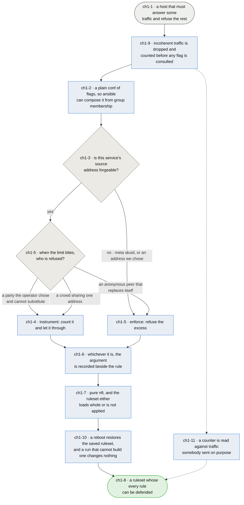

# Chapter 1 — the ruleset a host gets is the one somebody can argue for

> **As the person who has to enable this on live hosts I want every rule it generates to carry
> the reason it exists, so that the next reader inherits an argument instead of a habit — and so
> nobody "fixes" a decision by mistaking it for an oversight.**

**This chapter exists because that has already happened, twice, in opposite directions.** Every
inbound template writes its rate and connection limits with a `continue` verdict and follows them
with an unconditional accept, so the limits count excess and admit it. Read cold, that looks like a
bug — and on 2026-08-15 a reader concluded exactly that and was about to write new templates
"correctly". Earlier, a different reader had already done the reverse: **outbound tor and btc, and
the `orport`/`dirport`/`sshoverlay` templates, were rewritten to `over … drop` without the case for
enforcing being made.** So the package now carries enforcement postures nobody chose, and
instrumentation postures nobody explained, and no way to tell them apart by reading.

**The reasoning that was missing.** Enforcing a per-source limit is weaponisable: on UDP, where
spoofing is trivial and stateless, an attacker forging the *legitimate peer's* address exhausts that
peer's budget and silences the host you actually care about. `continue` also makes dynamic-set
exhaustion fail open — the sets hold 65535 entries at a 900s timeout, and if a failed `add` dropped,
a flood from random sources would deny everyone.

**But it is a starting point, not a verdict, and that distinction is the chapter.** tor and btc are
spoofable and a rate limit is still reasonable for them, because their usage patterns bound what a
legitimate rate looks like — outbound especially. There is no blanket answer in either direction.
**Each service is evaluated on its own traffic**, and the evaluation is written where the rule is.

**That evaluation has now been made** — every limit-bearing rule in the package carries a
`# LIMIT POSTURE:` note giving its verdict and the argument for it. Two things came out of doing it
that were not visible before. The bound-rate test turned out to be necessary and not sufficient:
syslog's legitimate rate is bounded far more tightly than bitcoin's and must still not enforce,
because **what separates them is who gets refused when the limit bites** (`ch1-5`). And inbound
`btc` was changed from instrumenting to enforcing to match the argument its own note makes,
alongside the `orport` and `dirport` rules it now agrees with — the one behavioural change in the
pass, made while the firewall is enabled on no host.

**This package is installed by strangers, and that changes what a default is for.** Whoever wrote
it is one consumer and not the audience: a default tuned to what one operator's hosts happen to run
is a default that fails everybody else silently. It is why ICMP is limited rather than closed —
crippling a stranger's ability to do network discovery or troubleshoot their own host is a worse
failure than admitting some noise — and it is the standing reason a posture argued from one
operator's traffic has to say so.

**Two more things bound every answer here and are not open to trade.** afirewall is **pure nft** — this package is
leaving iptables deliberately, which is why fwknop was rejected for depending on it. And
it must stay **administrable through ansible**: a host's ruleset follows from the groups the host is
in, which a configuration manager delivers by restoring the packaged `afirewall.conf` at the start of a run
and letting each service play add its own flags. That contract is what `ansible` chapter 9 is
written against, and this package's job is to keep its half of it.

*Shapes and colours: [legend](legend.md).*

## Story → test trace

| id | node | claim |
|---|---|---|
| `ch1-1` | a host that must answer some traffic and refuse the rest | **The generator's whole job is one host's ruleset, and both directions default to drop** — `base.rules` gives `hook input priority 20; policy drop` and `hook output priority filter; policy drop`, with a service's reply path admitted by that service's own flag rather than by one blanket `ct state established,related accept`. That is a deliberately unforgiving posture: an omitted flag is a dead service rather than a narrower one, which is a strong reason for the composition in `ch1-2` to be reviewable. **What this covers is a host, and only a host** — there is no `forward` chain in either family, so traffic a machine routes rather than terminates passes through untouched. That is a defensible scope for a host firewall and it is nowhere stated, which is `ch1-U8`: somebody enabling this on a router will believe it filters what it does not |
| `ch1-9` | incoherent traffic is dropped and counted before any flag is consulted | **The package's other reason to exist, and one it had never claimed.** Four chains run ahead of every service decision and independent of every flag, in **both families**: `SPOOFING` drops source addresses that cannot legitimately arrive on the external device, `INVALID_FLAGS` drops TCP segments whose flag combinations RFC 9293 does not permit — no flags at all, FIN with SYN, the scan fingerprints — `FRAGMENTS` drops non-first fragments, and `PORT_ZERO` drops port zero in either direction. **None of them consults the configuration**, so this is what a host gets from installing the package at all, before anybody decides what it runs. **The priority is part of the claim rather than a detail**: three run at `priority raw`, and `FRAGMENTS` runs at **-450** because `nf_defrag` hooks prerouting at -400 and a chain behind it is handed a reassembled datagram with no fragment left to match. Every one carries a named counter, which is the difference between a claim and a rule: `nft list counters` says whether it has ever fired, so a rule that does nothing is visible rather than assumed. **The counters made all three of this row's corrections**, on 2026-08-17: ipv6 `SPOOFING` had been at `mangle` since the genesis commit, ipv6 had no `FRAGMENTS` chain at all, and the ipv4 one that existed was behind defrag and could never fire. This is the property that other firewalls did not have, and it is why they were replaced rather than configured |
| `ch1-2` | a plain conf of flags | **The interface is `<direction>.<service>: enable` lines in a plain `afirewall.conf`, and keeping it plain is the requirement** — a configuration manager composes a host's ruleset by restoring the packaged defaults at the start of a converge and letting each service play add the flags it needs, so what afirewall reads has to be something ansible can add a line to without parsing a structure. **Administrable through ansible is a design constraint on this package, not a property of the consumer**, and a richer config format that made this harder would be a regression however much cleaner it read |
| `ch1-3` | is this service's source address forgeable? | **The first question, and only the first** — a limit that drops is a limit an attacker can aim. On UDP, where spoofing is trivial and stateless, forging the legitimate peer's address exhausts that peer's budget and silences precisely the host the rule was meant to protect. **On TCP the connection count is inflatable too, which an earlier cut of this row denied.** A forged SYN that the chain accepts reaches the confirm hook, so its conntrack entry is inserted and counts, and it lingers for the SYN_RECV timeout — 60s by default. The asymmetry is cost rather than possibility: filling a connection count needs forging sustained across that timeout, while one forged packet holds an address in a rate-limit set for the set's whole timeout, 900s in most templates here. **The one key that genuinely cannot be forged is `meta skuid`**, read from the local socket's owner, which is why the outbound templates are the clean case. The question is asked of the service and its transport together, never answered by category |
| `ch1-4` | instrument: count it and let it through | **A limit has three endings, not two, and the third is the one that gets misread.** `… } continue` falls to the unconditional accept below and instruments. `… over N } drop` refuses in as many words. But `… limit rate 10/second } accept` makes the limit a *match*: over the rate the rule stops matching, nothing beneath it accepts, and the chain policy drops — so it enforces without the word `drop` appearing anywhere. Every ICMP rule in `base.rules` is that third form, one file away from thirty rules in the first, so the posture is read from **the rule's own verdict** rather than from the presence of `drop`. **`continue` followed by an unconditional accept is a deliberate fail-open, and it buys two things** — an attacker cannot use the limit as a weapon against a named peer, and dynamic-set exhaustion degrades to "no accounting" rather than "no service", since a failed `add` on a full set leaves the packet to reach the accept. The counters remain readable with `nft list set`, so the traffic is *observed* without being *judged*. What this costs is real and should be said: nothing here stops a flood, and the package is not claiming to |
| `ch1-5` | enforce: a bounded rate, and collateral nobody will miss | **Spoofable does not automatically mean instrument-only** — tor and btc are the worked example, and working through every template turned the rule into something sharper than "is the rate bounded". A bounded rate is necessary and not sufficient: syslog's rate is bounded far more tightly than bitcoin's and still must not enforce. **The question that actually separates the two is who gets refused when the limit bites.** If the collateral is a counterparty the operator chose and cannot substitute — the admin on ssh, a correspondent MTA, a log shipper, a VPN peer, a host whose heartbeat is the alarm — enforcing hands an attacker a way to remove exactly that party, and instrumenting is right however bounded the rate. If the collateral is anonymous, self-replacing, and not sharing its address with anyone who matters — a bitcoin peer, a tor relay — a wrong drop costs nothing and enforcing is right. HTTP fails the test on the third clause rather than the second: the address is shared by a crowd, so the party refused is a stranger the site does want |
| `ch1-6` | the argument is recorded beside the rule | **The claim that would have prevented both mistakes.** A template carrying a limit records, next to it, whether that limit enforces or instruments and why — so a later reader inherits a decision rather than guessing at one. This is not documentation for its own sake: the twelve instrumenting templates were read as broken by one reader, and the enforcing ones were *written* by another who had no argument to read. An unexplained posture is indistinguishable from an accident, and both readers acted on that indistinguishability |
| `ch1-7` | pure nft, and the ruleset loads whole or not at all | **iptables is not an option, and the reason is a decision this package already took** — fwknop was rejected for depending on it. The other half is a property of nft the package already respects: a table containing one unloadable rule fails entirely, so `meta skuid nosuchuser` costs the host every rule in that family rather than one service. That is why services whose user is absent are disabled before generation rather than left to fail at load, and it is why validation runs ahead of `stop()`. **The first `nft -c` run taken against this ruleset proved the point immediately**: `templates/ipv6/inbound/tcp8000.rules` matched on `ip saddr` inside an `ip6` table, which is a parse error rather than a rule that matches nothing — so every host with `inbound.tcp8000` enabled would have had **no IPv6 firewall at all**, not one missing a rule |
| `ch1-10` | the ruleset a host gets after a reboot is the one it had | **A ruleset every rule of which can be defended is worth nothing if the host boots without it, and that is what happened.** Generated rules were written to `/run/afirewall`, which tmpfs empties at every boot, so `start` had nothing to restore and rebuilt instead — and `netfilter-persistent` runs this plugin *before the network is configured*, so `ip route get` found no route, no interface was discovered, and nothing was generated. Then the code deleted the four tables anyway and exited 0. Measured on a host on 2026-08-16: `Warning: no IPV4 interface found`, `Result=success`, `ExecMainStatus=0`, and not one table in the kernel. **Persisting is what this is a plugin FOR** — netfilter-persistent restores a saved ruleset at boot, every other plugin it runs works that way, and generating is what happens when the configuration changes rather than every time the machine starts. So the rules live in `/var/lib/afirewall`, and the two things this program does are named for what they do: **`restore`** loads the saved ruleset, **`regenerate`** rebuilds it from the configuration. `start` is an alias of `restore` and cannot be renamed — netfilter-persistent runs its plugins with `run-parts -a` and sends only `start`, `save` and `flush`, mapping its own `reload` and `restart` onto `start` too, so `start` is both what arrives at boot and what `systemctl restart netfilter-persistent` produces, and there is no verb it can send that means rebuild. A start that does not start reads as a mistake, which is why the honest name sits beside it rather than instead of it. **`restore` does not generate even as a fallback**: a verb that usually restores and occasionally rebuilds behaves according to state its caller cannot see, which is the shape of this whole fault, so nothing saved is a refusal that changes nothing and packaging closes that gap by regenerating once at install. **Two things follow that are claims rather than mechanics.** A run that cannot build a ruleset must leave the loaded one alone: no interface in *any* family now exits non-zero **before** the tables are deleted, because the only safe thing to do with a ruleset you cannot replace is nothing — while a single family finding none stays a warning, since a host without IPv6 is not a host with a broken IPv6 firewall. And a restored ruleset names the interface's address, so a host that boots on a new one restores rules describing the old: that is corrected by regenerating once the network is up, not by throwing the ruleset away, because a stale firewall is a smaller problem than no firewall and only one of the two announces itself |
| `ch1-11` | a counter is read against traffic somebody sent on purpose | **A counter nobody has aimed anything at is not evidence, and `ch1-9` is only true with this row under it.** That claim says `nft list counters` distinguishes a rule that works from one that matches nothing — and read against ambient traffic it does not, because a zero has three causes and the host cannot tell them apart: nothing of that kind arrived, the rule is unreachable, or something upstream dropped it first. All three were live at once on 2026-08-17. **A fleet host cannot settle it**, and that is a property of where the hosts lives rather than an excuse: every VPS here sits behind a provider's own firewall, which neither repository can read (`ansible` ch5 records the same wall from the other side), so the third cause is never excluded. Testing there would also mean opening a port in order to test a firewall. **So the target is a network namespace** — `tools/lab.py` builds two, wires them with a veth, renders the working tree's templates inside one and fires known-bad traffic from the other: a spoofed source, a NULL-flag segment, port zero, a non-first fragment, in both families. Nothing else is on that wire, so every packet that arrives is one the harness sent and a counter that does not move is the rule's fault. **What it does not prove** is that a ruleset is right for a real host — the addresses are the lab's and the traffic is synthetic — and `ch1-U2` is the harder question it does not yet answer, though it is the harness that could |
| `ch1-8` | a ruleset whose every rule can be defended | **The measure is that a reader can ask "why does this rule do that?" and the file answers** — not that the ruleset is maximally strict, which is a different and lesser property. A rule that is defensible can be changed deliberately; a rule that is merely present gets changed by whoever is most confident |

## Input → process → output

**Input** — a host that must answer some traffic and refuse the rest (`ch1-1`).

**The interface stays plain, because the configurator composes it.** A host's ruleset is selected by flags
in `afirewall.conf`, which ansible builds by restoring the packaged defaults and letting each
service play add what it needs (`ch1-2`).

**Each service's limit posture is argued from its own traffic.** The first question is whether the
source address can be forged (`ch1-3`) — and only the outbound `meta skuid` rules and the outbound
ICMP limits, keyed on an address this host picked, can answer no. Everything else reaches the
second question: when the limit bites, who is refused (`ch1-5`)? A party the operator chose and
cannot substitute, or a crowd sharing one address, means instrument — count it and admit it
(`ch1-4`). An anonymous peer that replaces itself means the collateral costs nothing and the limit
can enforce. Whichever it is, the reasoning is written beside the rule (`ch1-6`), and the whole
ruleset is pure nft that loads completely or is not applied (`ch1-7`).

**Output** — a ruleset whose every rule can be defended (`ch1-8`).

## Open unknowns

- **ch1-U12 — the fragment evasion RFC 7112 is about is only half closed.** `FRAGMENTS` drops
  non-first fragments, so reassembly never completes and the follow-on fragments die. What it
  cannot ask is the question the RFC actually poses: whether a *first* fragment carried the entire
  header chain through the upper-layer header. A first fragment that does not is admitted to the
  service chains with its L4 ports in a companion this chain has just dropped, so the port rules
  match on nothing and the packet is decided by the wrong rule rather than the right one.
  nftables has no selector for "the header chain is complete", so closing it means either
  dropping every fragment — which costs large UDP, DNSSEC answers first — or accepting that this
  is a partial mitigation and saying so. The second is what is written today and the choice has
  not been argued. Anchored to `ch1-9`.

- **ch1-U2 — nothing here observes a limit doing its job.** The tests can show a template renders,
  that the ruleset loads, and that a posture is recorded. Whether a rate limit set above a bounded
  legitimate rate actually refuses abuse without refusing use is a claim about traffic, and the only
  honest way to settle it is to generate the load. Anchored to `ch1-5`.

- **ch1-U8 — there is no `forward` chain, and nothing says so.** The package hooks `input`,
  `output` and a `prerouting` chain that drops port-zero traffic. A packet a host *routes* is
  DNATed at prerouting, sent to `forward` by the routing decision, and leaves at postrouting —
  never passing the chain that carries this package's `policy drop`. So on any machine that
  forwards, afirewall governs what the machine itself answers and nothing it passes along.

  **This was found by trying to write a rule that would have done nothing.** A host that publishes a
  port by DNAT to a machine across a tunnel terminates none of that traffic, so a flag opening the
  published port would have parsed, persisted, survived a reload and opened nothing. Host-only is a reasonable scope for a host firewall, and the
  open part is that the package claims neither the scope nor its limit anywhere a reader will find
  it. Whether the answer is a sentence in the README or a `forward` chain is undecided; the
  sentence is owed either way. Anchored to `ch1-1`.

- **ch1-U9 — "external" is a trust judgement and the routing table is not a trust database.**
  The firewall finds its external interface by asking which one the default route uses. Measured
  across eight hosts on 2026-08-16 it is right on all eight — and that is the configuration being
  agreeable rather than the method being sound.

  **A full-tunnel VPN inverts it, and every one of those hosts has a `wg0` sitting there.** One
  `AllowedIPs = 0.0.0.0/0` is all it takes: the default route moves to the tunnel, discovery
  returns `wg0` as external, and the anti-spoofing rules are then applied to the *overlay* — where
  a private source is entirely legitimate — and **not** to the physical NIC, where it would be
  forged. Backwards, and with nothing anywhere to say so. It is the same failure as the IPv6 device
  regex arriving through a different door: a derived fact that looks right until the day it is not.

  **And only one interface is protected at all.** Those hosts carry between two and five —
  `ens6`, `wg0`, `docker0`, bridges, veths — and the `SPOOFING` chain names exactly one of them.
  For the tunnel that is deliberate (`iifname` was added precisely so spoof drops stopped killing
  what `wg0` carried), but the model it encodes is "a host has one external interface", and the
  measurement says a host here has several with different trust levels.

  **Neither of the two firewalls most people meet guesses at this, and they disagree about how not
  to** — read out of the packages on 2026-08-16 rather than recalled.

  `ufw` does not ask the question at all. There is no interface discovery anywhere in it, no
  source-based anti-spoofing, and — contrary to what one would expect — no `rp_filter` setting in
  its `sysctl.conf` either. What it has instead is `ufw-not-local`: `addrtype --dst-type
  LOCAL/MULTICAST/BROADCAST` returns, and everything else is dropped. That asks **"is this packet
  addressed to me?"**, which is interface-agnostic, so no interface ever has to be identified.

  `firewalld` makes you answer it. Nine zones — one of them called `external` — a `DefaultZone` of
  `public`, and no discovery code at all: an interface is assigned to a zone by the operator or by
  NetworkManager, and an unassigned one falls to the default. Stated, with a safe fallback.

  **So one sidesteps the question and the other requires an answer, and this package is alone in
  inferring one.**

  **The kernel's own answer is weaker than it looks.** Measured across the hosts: every interface on
  every host carries `rp_filter=2`, which is *loose* reverse-path filtering — it drops only sources
  unreachable by any route, not a private source arriving where it could not have come from. And
  **there is no IPv6 rp_filter at all**; the file does not exist. So for IPv6 a firewall is the only
  place anti-spoofing can live, which makes `SPOOFING` matter most in exactly the
  family whose ruleset had never loaded until 2026-08-16.

  **What follows.** A better heuristic is not available — deriving "external" from "which address is
  globally routable" fails on a NAT'd VPS, whose only interface is external and privately addressed.
  So the answer is firewalld's: **let it be stated**, with discovery as the default for the
  single-NIC case this was written for. And `ufw`'s check is worth having beside it rather than
  instead of it: a `fib daddr type local` drop needs no statement and holds even when the statement
  is wrong, while catching nothing the spoof list catches — the two fail in different directions,
  which is the argument for both.

  Where the statement lives is the remaining part. `ch1-2` keeps `afirewall.conf` a flat list of
  service flags, and firewalld's precedent is to keep zone assignment out of the service definitions
  entirely. Anchored to `ch1-1`.

- **ch1-U10 — one service's flag opens a rule that is not a reply, and its name does not say so.**
  Every `outbound.<service>` line opens two things: the outbound accept, and an inbound line for the
  traffic coming back. For every service but one that inbound line is a conntrack reply path and the
  name reads correctly. **DHCP is the exception.** A client that broadcasts or multicasts its
  request is answered from the server's own unicast address, so the tuples do not match, the reply
  arrives INVALID or NEW, and `ct state established` never fires. Its inbound line has to be a real
  accept matched on the port pair, which is what it now is.

  **Measured, and the two families disagreed — which is the part worth keeping.** With the old
  `ct state established` reply rule in place: IPv6 counted a ten-minute lease down to 25 seconds
  without renewing, and lost the address outright on a forced reconfigure. IPv4 renewed *and* fully
  re-acquired through the same firewall, because `systemd-networkd` unicasts to a server it already
  knows. **So IPv4 was never broken** — and it is not broken because the *client* chose unicast,
  not because the rule covered it. A firewall that depends on which destination a client picks works
  until the client changes.

  **What stays undecided is the name, not the behaviour.** One flag opening both halves is right,
  and a test pins it: splitting DHCP into `inbound.dhcp` and `outbound.dhcp` would make enabling one
  and not the other a way to lose an address with nothing to say so.

  **A third `bidirectional` direction is the obvious answer and is the wrong one.** The config
  *parser* would take it — `branch()` splits on `.` and builds a tree from any key, so
  `bidirectional.dhcp` parses today. Everything else is hardwired to two: the template variables
  passed to Jinja, `add-service`'s `--inbound`/`--outbound`, the loop that reads which users a
  service matches, the loop that disables services whose user is absent, the
  `templates/<family>/<direction>/` layout, and the skew tests either side of it.

  The cost is not the reason to refuse, though. **`bidirectional` is a different kind of thing from
  `inbound` and `outbound`.** Those name a *hook*; that names a *cardinality*. Putting them in one
  namespace is a category error, and it would have exactly one member — a name for a special case
  rather than a category. Every service already produces rules in both chains; DHCP is not unusual
  in being bidirectional, it is unusual in that its inbound rule cannot be a conntrack match.

  **And there is a real third direction coming.** Namespaces (`ch4`) need `forward` — traffic that
  is neither into nor out of this host — which *is* a hook and does belong beside the other two.
  Adding `bidirectional` first would mean generalising the enumeration twice, and leaving a
  category that does not sit alongside `forward` when it arrives. The enumeration should grow when
  there is a hook to grow it for. Anchored to `ch1-2`.

- **ch1-U7 — `source-quench` is still accepted and RFC 6633 deprecated it.** Routers no longer send
  it and hosts are told to ignore it, so the rule can only ever admit something forged. It went
  unremarked while the timestamp, information and address-mask messages were removed, because those
  were asked about and this was not. Anchored to `ch1-1`.

- **ch1-U4 — the bacula templates have no traffic to argue from.** They ship with the package and
  nothing known to it has ever enabled them. Their postures are recorded as what the rules do
  rather than as a choice, and say so. Either they get argued against real bacula behaviour or they
  get removed, and doing nothing leaves three templates whose notes are honest about being
  inherited. Anchored to `ch1-6`.

- **ch1-U5 — the host has two things that restore a ruleset at boot, and one of them begins by
  deleting everything.** The package persists through `netfilter-persistent`, which is right: it
  installs `/usr/sbin/afirewall` as a plugin, and `stop()` deletes only the four `a-firewall-*`
  tables rather than flushing, so nothing this package does can remove somebody else's rules. But
  a configuration manager that also enables `nftables.service` meets a problem: Debian's shipped
  `/etc/nftables.conf` — read on the workstation, not recalled — opens with `flush ruleset` and
  then declares a `table inet filter` whose chains state **no policy at all**, which means accept.
  If that unit loads after the plugin, the host has no firewall and three chains that admit
  everything. Both units order themselves against `network-pre.target` and, as far as this repo can
  tell, against each other not at all. **This is the ordering hazard, and it is not chain priority**
  — the verdict is order-independent there, because netfilter requires every base chain at a hook to
  accept and an `accept` in one does not skip the others. What is not settled is the unit ordering
  itself, which has to be read on a host. Anchored to `ch1-1`.

- **ch1-U11 — installing a firewall does not switch one on, and nobody has decided whether it
  should.** The package ships no `postinst`, so a fresh install saves no ruleset. `restore` then has
  nothing to restore, and since `ch1-10` it refuses rather than rebuilding — correct in itself, but
  it means installing this package could mark `netfilter-persistent.service` failed on a host that
  had never been configured. It does not today, only because that unit ships disabled: `a host` had to
  be enabled by hand on 2026-08-16, and until somebody does, the plugin is never invoked and the
  question never arises. **That is a reprieve rather than an answer**, and the shape of the answer is
  a policy question this package cannot settle from its own side. A `postinst` running `regenerate`
  would mean installing a firewall gets you a firewall, immediately and at every boot, which is
  arguably what the words mean — and the shipped baseline is built for exactly that, since it
  enables `inbound.ssh` and the outbound half a host needs rather than starting from everything
  closed. Against it: this package is installed by strangers whose hosts run services the baseline
  knows nothing about, and a firewall that switches itself on during `apt install` is a firewall
  that took a decision on their behalf. The estate that wrote it does not need one either way — its
  configuration manager installs, regenerates and enables explicitly — so the case for choosing is
  entirely about the stranger, which is the reader this chapter already says defaults are for.
  Anchored to `ch1-10`.

- **ch1-U6 — the package claims pure nft and ships nothing that keeps a public installation pure.**
  fail2ban's Debian default `banaction` is iptables, so a stranger who installs afirewall and
  fail2ban gets exactly the mixture this package exists to leave. It *functions* — a ban lands in
  the `filter` table at priority 0, ahead of this package's input chain at 20, so it takes effect —
  but functioning is not the claim. The fix is one line in fail2ban's own configuration and is
  documented in the README, which means it exists and lives outside this package: nobody installing
  it gets it, and nothing here tells them the mixture happened. Anchored to `ch1-7`.

## Glossary

| Term | Meaning |
|---|---|
| Flag | A `<direction>.<service>: enable` line selecting a rules template at generate time (`ch1-2`) |
| Instrument | A limit whose rule ends `continue`: the packet falls to the unconditional accept below, so excess is counted and admitted (`ch1-4`) |
| Enforce | A limit whose rule does not end `continue`. Either `over … drop`, or `limit rate N } accept` — where over the rate the rule stops matching, nothing beneath it accepts, and the chain policy drops (`ch1-4`, `ch1-5`) |
| Collateral | Whoever is refused when a limit bites. The question `ch1-5` turns on, because it is what enforcing costs |
| Limit posture | Which of those two a service uses, and the argument for it (`ch1-6`) |
