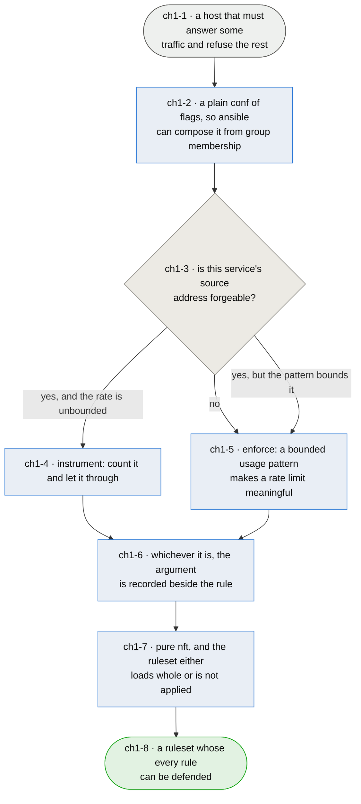

# Chapter 1 — the ruleset a host gets is the one somebody can argue for

> **As the person who has to enable this on a live hosts I want every rule it generates to carry
> the reason it exists, so that the next reader inherits an argument instead of a habit — and so
> nobody "fixes" a decision by mistaking it for an oversight.**

**This chapter exists because that has already happened, twice, in opposite directions.** Every
inbound template writes its rate and connection limits with a `continue` verdict and follows them
with an unconditional accept, so the limits count excess and admit it. Read cold, that looks like a
bug — and on 2026-08-15 a reader concluded exactly that and was about to write new templates
"correctly". Earlier, a different reader had already done the reverse: **outbound tor and btc, and
the `orport`/`dirport`/`sshoverlay` templates, were rewritten to `over … drop` without the case for
enforcing being made.** So the package now carries enforcement postures nobody chose, and
instrumentation postures nobody explained, and no way to tell them apart by reading.

**The reasoning that was missing.** Enforcing a per-source limit is weaponisable: on UDP, where
spoofing is trivial and stateless, an attacker forging the *legitimate peer's* address exhausts that
peer's budget and silences the host you actually care about. `continue` also makes dynamic-set
exhaustion fail open — the sets hold 65535 entries at a 900s timeout, and if a failed `add` dropped,
a flood from random sources would deny everyone.

**But it is a starting point, not a verdict, and that distinction is the chapter.** tor and btc are
spoofable and a rate limit is still reasonable for them, because their usage patterns bound what a
legitimate rate looks like — outbound especially. There is no blanket answer in either direction.
**Each service is evaluated on its own traffic**, and the evaluation is written where the rule is.

**Two things bound every answer here and are not open to trade.** afirewall is **pure nft** — the
deployment is leaving iptables deliberately, which is why fwknop was rejected for depending on it. And
it must stay **administrable through ansible**: a host's ruleset follows from the groups the host is
in, which a fleet delivers by restoring the packaged `afirewall.conf` at the start of a converge
and letting each service play add its own flags. That contract is what `ansible` chapter 9 is
written against, and this package's job is to keep its half of it.

*Shapes and colours: [legend](legend.md).*

## Story → test trace

| id | node | claim |
|---|---|---|
| `ch1-1` | a host that must answer some traffic and refuse the rest | **The generator's whole job is one host's ruleset, and both directions default to drop** — `base.rules` gives `hook input priority 20; policy drop` and `hook output priority filter; policy drop`, with a service's reply path admitted by that service's own flag rather than by one blanket `ct state established,related accept`. That is a deliberately unforgiving posture: an omitted flag is a dead service rather than a narrower one, which is a strong reason for the composition in `ch1-2` to be reviewable |
| `ch1-2` | a plain conf of flags | **The interface is `<direction>.<service>: enable` lines in a plain `afirewall.conf`, and keeping it plain is the requirement** — a fleet composes a host's ruleset by restoring the packaged defaults at the start of a converge and letting each service play add the flags it needs, so what afirewall reads has to be something ansible can add a line to without parsing a structure. **Administrable through ansible is a design constraint on this package, not a property of the consumer**, and a richer config format that made this harder would be a regression however much cleaner it read |
| `ch1-3` | is this service's source address forgeable? | **The first question, and only the first** — a limit that drops is a limit an attacker can aim. On UDP, where spoofing is trivial and stateless, forging the legitimate peer's address exhausts that peer's budget and silences precisely the host the rule was meant to protect. On TCP the picture splits: `ct state new` counts SYNs, which are spoofable, while `ct count` requires a completed handshake and so cannot be inflated by a forged source. The question is asked of the service and its transport together, never answered by category |
| `ch1-4` | instrument: count it and let it through | **`continue` followed by an unconditional accept is a deliberate fail-open, and it buys two things** — an attacker cannot use the limit as a weapon against a named peer, and dynamic-set exhaustion degrades to "no accounting" rather than "no service", since a failed `add` on a full set leaves the packet to reach the accept. The counters remain readable with `nft list set`, so the traffic is *observed* without being *judged*. What this costs is real and should be said: nothing here stops a flood, and the package is not claiming to |
| `ch1-5` | enforce: a bounded usage pattern makes a limit meaningful | **Spoofable does not automatically mean instrument-only** — tor and btc are the worked example. Their traffic has a shape: a legitimate peer's rate is bounded by the protocol's own behaviour, so a limit set above that bound refuses abuse without refusing use, and the outbound direction is safer still because the source address is this host's own. **The test is not "can it be spoofed" but "does a legitimate rate exist that is comfortably below the limit"**, and where it does, enforcing is the better answer |
| `ch1-6` | the argument is recorded beside the rule | **The claim that would have prevented both mistakes.** A template carrying a limit records, next to it, whether that limit enforces or instruments and why — so a later reader inherits a decision rather than guessing at one. This is not documentation for its own sake: the twelve instrumenting templates were read as broken by one reader, and the enforcing ones were *written* by another who had no argument to read. An unexplained posture is indistinguishable from an accident, and both readers acted on that indistinguishability |
| `ch1-7` | pure nft, and the ruleset loads whole or not at all | **iptables is not an option, and the reason is a decision the operator already took** — fwknop was rejected for depending on it. The other half is a property of nft the package already respects: a table containing one unloadable rule fails entirely, so `meta skuid nosuchuser` costs the host every rule in that family rather than one service. That is why services whose user is absent are disabled before generation rather than left to fail at load, and it is why validation runs ahead of `stop()` |
| `ch1-8` | a ruleset whose every rule can be defended | **The measure is that a reader can ask "why does this rule do that?" and the file answers** — not that the ruleset is maximally strict, which is a different and lesser property. A rule that is defensible can be changed deliberately; a rule that is merely present gets changed by whoever is most confident |

## Input → process → output

**Input** — a host that must answer some traffic and refuse the rest (`ch1-1`).

**The interface stays plain, because a fleet composes it.** A host's ruleset is selected by flags
in `afirewall.conf`, which ansible builds by restoring the packaged defaults and letting each
service play add what it needs (`ch1-2`).

**Each service's limit posture is argued from its own traffic.** The first question is whether the
source address can be forged (`ch1-3`); a forgeable source with no bounded legitimate rate is
instrumented, counted and admitted (`ch1-4`); a source that cannot be forged, or one whose usage
pattern puts a real bound well under the limit, may be enforced (`ch1-5`). Whichever it is, the
reasoning is written beside the rule (`ch1-6`), and the whole ruleset is pure nft that loads
completely or is not applied (`ch1-7`).

**Output** — a ruleset whose every rule can be defended (`ch1-8`).

## Open unknowns

- **ch1-U1 — the existing postures have not been re-argued, only inventoried.** Twelve inbound
  templates instrument and several outbound ones enforce, and this chapter says the reasoning must
  sit beside the rule without yet saying what the reasoning *is* for each. Doing that is a pass over
  every template asking `ch1-3` and `ch1-5` of it, and it is the work this chapter was written to
  make possible rather than work it has done. Anchored to `ch1-6`.

- **ch1-U2 — nothing here observes a limit doing its job.** The tests can show a template renders,
  that the ruleset loads, and that a posture is recorded. Whether a rate limit set above a bounded
  legitimate rate actually refuses abuse without refusing use is a claim about traffic, and the only
  honest way to settle it is to generate the load. Anchored to `ch1-5`.

## Glossary

| Term | Meaning |
|---|---|
| Flag | A `<direction>.<service>: enable` line selecting a rules template at generate time (`ch1-2`) |
| Instrument | A limit written with `continue` and followed by an accept: excess is counted and admitted (`ch1-4`) |
| Enforce | A limit written `over … drop`: excess is refused (`ch1-5`) |
| Limit posture | Which of those two a service uses, and the argument for it (`ch1-6`) |
