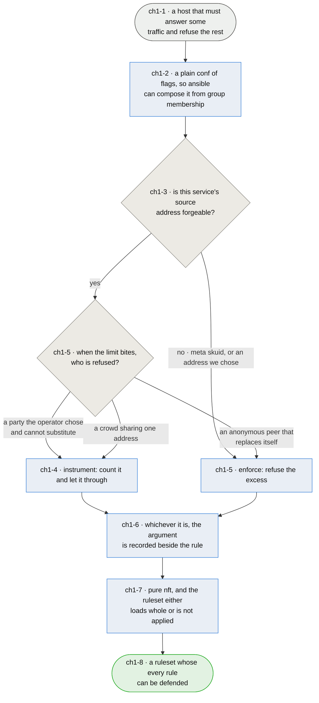

# Chapter 1 — the ruleset a host gets is the one somebody can argue for

> **As the person who has to enable this on a live hosts I want every rule it generates to carry
> the reason it exists, so that the next reader inherits an argument instead of a habit — and so
> nobody "fixes" a decision by mistaking it for an oversight.**

**This chapter exists because that has already happened, twice, in opposite directions.** Every
inbound template writes its rate and connection limits with a `continue` verdict and follows them
with an unconditional accept, so the limits count excess and admit it. Read cold, that looks like a
bug — and on 2026-08-15 a reader concluded exactly that and was about to write new templates
"correctly". Earlier, a different reader had already done the reverse: **outbound tor and btc, and
the `orport`/`dirport`/`sshoverlay` templates, were rewritten to `over … drop` without the case for
enforcing being made.** So the package now carries enforcement postures nobody chose, and
instrumentation postures nobody explained, and no way to tell them apart by reading.

**The reasoning that was missing.** Enforcing a per-source limit is weaponisable: on UDP, where
spoofing is trivial and stateless, an attacker forging the *legitimate peer's* address exhausts that
peer's budget and silences the host you actually care about. `continue` also makes dynamic-set
exhaustion fail open — the sets hold 65535 entries at a 900s timeout, and if a failed `add` dropped,
a flood from random sources would deny everyone.

**But it is a starting point, not a verdict, and that distinction is the chapter.** tor and btc are
spoofable and a rate limit is still reasonable for them, because their usage patterns bound what a
legitimate rate looks like — outbound especially. There is no blanket answer in either direction.
**Each service is evaluated on its own traffic**, and the evaluation is written where the rule is.

**That evaluation has now been made** — every limit-bearing rule in the package carries a
`# LIMIT POSTURE:` note giving its verdict and the argument for it. Two things came out of doing it
that were not visible before. The bound-rate test turned out to be necessary and not sufficient:
syslog's legitimate rate is bounded far more tightly than bitcoin's and must still not enforce,
because **what separates them is who gets refused when the limit bites** (`ch1-5`). And inbound
`btc` was changed from instrumenting to enforcing to match the argument its own note makes,
alongside the `orport` and `dirport` rules it now agrees with — the one behavioural change in the
pass, made while the firewall is enabled on no host.

**Two things bound every answer here and are not open to trade.** afirewall is **pure nft** — the
deployment is leaving iptables deliberately, which is why fwknop was rejected for depending on it. And
it must stay **administrable through ansible**: a host's ruleset follows from the groups the host is
in, which a fleet delivers by restoring the packaged `afirewall.conf` at the start of a converge
and letting each service play add its own flags. That contract is what `ansible` chapter 9 is
written against, and this package's job is to keep its half of it.

*Shapes and colours: [legend](legend.md).*

## Story → test trace

| id | node | claim |
|---|---|---|
| `ch1-1` | a host that must answer some traffic and refuse the rest | **The generator's whole job is one host's ruleset, and both directions default to drop** — `base.rules` gives `hook input priority 20; policy drop` and `hook output priority filter; policy drop`, with a service's reply path admitted by that service's own flag rather than by one blanket `ct state established,related accept`. That is a deliberately unforgiving posture: an omitted flag is a dead service rather than a narrower one, which is a strong reason for the composition in `ch1-2` to be reviewable |
| `ch1-2` | a plain conf of flags | **The interface is `<direction>.<service>: enable` lines in a plain `afirewall.conf`, and keeping it plain is the requirement** — a fleet composes a host's ruleset by restoring the packaged defaults at the start of a converge and letting each service play add the flags it needs, so what afirewall reads has to be something ansible can add a line to without parsing a structure. **Administrable through ansible is a design constraint on this package, not a property of the consumer**, and a richer config format that made this harder would be a regression however much cleaner it read |
| `ch1-3` | is this service's source address forgeable? | **The first question, and only the first** — a limit that drops is a limit an attacker can aim. On UDP, where spoofing is trivial and stateless, forging the legitimate peer's address exhausts that peer's budget and silences precisely the host the rule was meant to protect. **On TCP the connection count is inflatable too, which an earlier cut of this row denied.** A forged SYN that the chain accepts reaches the confirm hook, so its conntrack entry is inserted and counts, and it lingers for the SYN_RECV timeout — 60s by default. The asymmetry is cost rather than possibility: filling a connection count needs forging sustained across that timeout, while one forged packet holds an address in a rate-limit set for the set's whole timeout, 900s in most templates here. **The one key that genuinely cannot be forged is `meta skuid`**, read from the local socket's owner, which is why the outbound templates are the clean case. The question is asked of the service and its transport together, never answered by category |
| `ch1-4` | instrument: count it and let it through | **A limit has three endings, not two, and the third is the one that gets misread.** `… } continue` falls to the unconditional accept below and instruments. `… over N } drop` refuses in as many words. But `… limit rate 10/second } accept` makes the limit a *match*: over the rate the rule stops matching, nothing beneath it accepts, and the chain policy drops — so it enforces without the word `drop` appearing anywhere. Every ICMP rule in `base.rules` is that third form, one file away from thirty rules in the first, so the posture is read from **the rule's own verdict** rather than from the presence of `drop`. **`continue` followed by an unconditional accept is a deliberate fail-open, and it buys two things** — an attacker cannot use the limit as a weapon against a named peer, and dynamic-set exhaustion degrades to "no accounting" rather than "no service", since a failed `add` on a full set leaves the packet to reach the accept. The counters remain readable with `nft list set`, so the traffic is *observed* without being *judged*. What this costs is real and should be said: nothing here stops a flood, and the package is not claiming to |
| `ch1-5` | enforce: a bounded rate, and collateral nobody will miss | **Spoofable does not automatically mean instrument-only** — tor and btc are the worked example, and working through every template turned the rule into something sharper than "is the rate bounded". A bounded rate is necessary and not sufficient: syslog's rate is bounded far more tightly than bitcoin's and still must not enforce. **The question that actually separates the two is who gets refused when the limit bites.** If the collateral is a counterparty the operator chose and cannot substitute — the admin on ssh, a correspondent MTA, a log shipper, a VPN peer, a host whose heartbeat is the alarm — enforcing hands an attacker a way to remove exactly that party, and instrumenting is right however bounded the rate. If the collateral is anonymous, self-replacing, and not sharing its address with anyone who matters — a bitcoin peer, a tor relay — a wrong drop costs nothing and enforcing is right. HTTP fails the test on the third clause rather than the second: the address is shared by a crowd, so the party refused is a stranger the site does want |
| `ch1-6` | the argument is recorded beside the rule | **The claim that would have prevented both mistakes.** A template carrying a limit records, next to it, whether that limit enforces or instruments and why — so a later reader inherits a decision rather than guessing at one. This is not documentation for its own sake: the twelve instrumenting templates were read as broken by one reader, and the enforcing ones were *written* by another who had no argument to read. An unexplained posture is indistinguishable from an accident, and both readers acted on that indistinguishability |
| `ch1-7` | pure nft, and the ruleset loads whole or not at all | **iptables is not an option, and the reason is a decision the operator already took** — fwknop was rejected for depending on it. The other half is a property of nft the package already respects: a table containing one unloadable rule fails entirely, so `meta skuid nosuchuser` costs the host every rule in that family rather than one service. That is why services whose user is absent are disabled before generation rather than left to fail at load, and it is why validation runs ahead of `stop()` |
| `ch1-8` | a ruleset whose every rule can be defended | **The measure is that a reader can ask "why does this rule do that?" and the file answers** — not that the ruleset is maximally strict, which is a different and lesser property. A rule that is defensible can be changed deliberately; a rule that is merely present gets changed by whoever is most confident |

## Input → process → output

**Input** — a host that must answer some traffic and refuse the rest (`ch1-1`).

**The interface stays plain, because a fleet composes it.** A host's ruleset is selected by flags
in `afirewall.conf`, which ansible builds by restoring the packaged defaults and letting each
service play add what it needs (`ch1-2`).

**Each service's limit posture is argued from its own traffic.** The first question is whether the
source address can be forged (`ch1-3`) — and only the outbound `meta skuid` rules and the outbound
ICMP limits, keyed on an address this host picked, can answer no. Everything else reaches the
second question: when the limit bites, who is refused (`ch1-5`)? A party the operator chose and
cannot substitute, or a crowd sharing one address, means instrument — count it and admit it
(`ch1-4`). An anonymous peer that replaces itself means the collateral costs nothing and the limit
can enforce. Whichever it is, the reasoning is written beside the rule (`ch1-6`), and the whole
ruleset is pure nft that loads completely or is not applied (`ch1-7`).

**Output** — a ruleset whose every rule can be defended (`ch1-8`).

## Open unknowns

- **ch1-U2 — nothing here observes a limit doing its job.** The tests can show a template renders,
  that the ruleset loads, and that a posture is recorded. Whether a rate limit set above a bounded
  legitimate rate actually refuses abuse without refusing use is a claim about traffic, and the only
  honest way to settle it is to generate the load. Anchored to `ch1-5`.

- **ch1-U3 — the IPv4 side rate-limits the signal path-MTU discovery runs on, and the IPv6 side
  does not.** **The posture is settled and is not the open part.** ICMP has many uses and this is a
  package other people install, so the default must not cripple network discovery or
  troubleshooting: allow it from anywhere and *limit* it, which is what the rules do and what long
  IPv4 practice supports. The limit is generous against real diagnostic traffic — `ping` sends
  1/second, and a traceroute's `time-exceeded` replies each come from a *different* router, so a
  per-source bucket of 10/second is never reached by a legitimate operator. It is reached by
  `ping -f`, which is the traffic it is for.

  What is still open is one message rather than the posture. `fragmentation-needed` is a *subtype*
  of `destination-unreachable`, and the IPv4 rules limit `destination-unreachable` as a whole — so
  the signal a black-holed TCP connection depends on shares a bucket with every diagnostic message.
  **The IPv6 side already makes the carve-out**, accepting `packet-too-big` ahead of and outside the
  limit, so the two families disagree about a message that is not a diagnostic at all. Mirroring the
  IPv6 decision is one rule and no change of posture. Anchored to `ch1-5`.

- **ch1-U4 — the bacula templates have no traffic to argue from.** No play in a fleet enables any
  bacula flag; the operator backs up with the backup tool. Their postures are recorded as what the rules do
  rather than as a choice, and say so. Either they get argued against real bacula behaviour or they
  get removed, and doing nothing leaves three templates whose notes are honest about being
  inherited. Anchored to `ch1-6`.

- **ch1-U5 — the host has two things that restore a ruleset at boot, and one of them begins by
  deleting everything.** The package persists through `netfilter-persistent`, which is right: it
  installs `/usr/sbin/afirewall` as a plugin, and `stop()` deletes only the four `a-firewall-*`
  tables rather than flushing, so nothing this package does can remove somebody else's rules. But
  `a play` in a fleet also enables `nftables.service`, and Debian's shipped
  `/etc/nftables.conf` — read on the workstation, not recalled — opens with `flush ruleset` and
  then declares a `table inet filter` whose chains state **no policy at all**, which means accept.
  If that unit loads after the plugin, the host has no firewall and three chains that admit
  everything. Both units order themselves against `network-pre.target` and, as far as this repo can
  tell, against each other not at all. **This is the ordering hazard, and it is not chain priority**
  — the verdict is order-independent there, because netfilter requires every base chain at a hook to
  accept and an `accept` in one does not skip the others. What is not settled is the unit ordering
  itself, which has to be read on a host. Anchored to `ch1-1`.

- **ch1-U6 — the package claims pure nft and ships nothing that keeps a public installation pure.**
  fail2ban's Debian default `banaction` is iptables, so a stranger who installs afirewall and
  fail2ban gets exactly the mixture this package exists to leave. It *functions* — a ban lands in
  the `filter` table at priority 0, ahead of this package's input chain at 20, so it takes effect —
  but functioning is not the claim. The operator pins `banaction = nftables` in ansible
  (`a play`), which means the fix exists and lives in the wrong repository: nobody installing
  the package gets it. Anchored to `ch1-7`.

## Glossary

| Term | Meaning |
|---|---|
| Flag | A `<direction>.<service>: enable` line selecting a rules template at generate time (`ch1-2`) |
| Instrument | A limit whose rule ends `continue`: the packet falls to the unconditional accept below, so excess is counted and admitted (`ch1-4`) |
| Enforce | A limit whose rule does not end `continue`. Either `over … drop`, or `limit rate N } accept` — where over the rate the rule stops matching, nothing beneath it accepts, and the chain policy drops (`ch1-4`, `ch1-5`) |
| Collateral | Whoever is refused when a limit bites. The question `ch1-5` turns on, because it is what enforcing costs |
| Limit posture | Which of those two a service uses, and the argument for it (`ch1-6`) |
