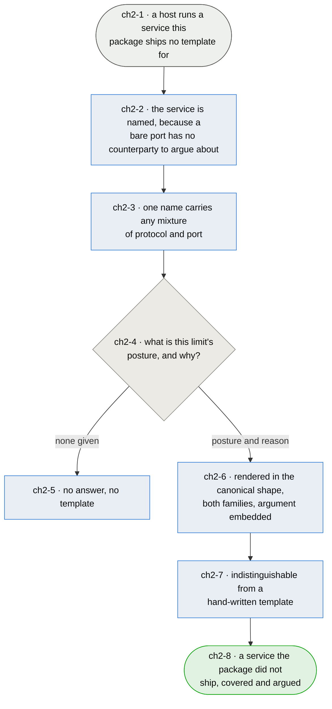

# Chapter 2 — a service can be added without knowing how a template is written

> **As somebody who installed this package to protect a host I want to open a port for a service it
> ships no template for, without learning the template's layout, so that the firewall covers what I
> actually run rather than the subset its author happened to write templates for.**

**The package's coverage is its weakest public claim.** It offers named services — ssh, http, smtp,
bacula, tor — and a host running postgres, or a game on udp 7777, or anything else, has no flag to
enable. The person in that position has three options today: write a template by hand, run the
service unprotected, or not use the package. All three are bad, and the third is the one most
people pick.

**Writing a template by hand is harder than it looks and that is not incidental.** The templates are
whitespace-sensitive Jinja: the indentation, the blank lines and the placement of the `set`
declarations relative to the `chain` all decide whether the generated nft renders legibly or as one
run-on block. Nothing validates the shape, `nft` will happily load an ugly ruleset, and the person
finding out is whoever reads it next.

**So the fix is a generator, and the generator is where the argument gets made mandatory.** This is
the part that is not just convenience. Chapter 1 says every limit records whether it enforces or
instruments and why (`ch1-6`), and that claim has already been broken twice by people writing rules
with no argument to inherit. A tool that renders a template can *demand* the posture and the reason
as arguments — so an unargued rule becomes unwritable rather than something a later pass has to
find. `ch1-U1` was a sweep over 36 files; nothing should ever need that sweep again.

**Named services stay, and the reason is not convenience either.** Going to bare port and protocol
was the obvious alternative and it is the wrong one: `ch1-5` decides a posture by asking *who is
refused when the limit bites*, and a rule for `tcp/9999` has no counterparty to answer with. The
name is what the argument attaches to. What the name must NOT do is imply one port — a service can
want udp and tcp on the same number — so a service is a set of protocol/port pairs under one flag.

*Shapes and colours: [legend](legend.md).*

## Story → test trace

| id | node | claim |
|---|---|---|
| `ch2-1` | a host runs a service this package ships no template for | **Coverage is a real defect and not a backlog item.** Seventeen inbound templates and a handful of outbound ones is a small fraction of what a Debian host runs, and two of the first three services one operator went looking for had no flag to enable. Every user hits this eventually, and the failure is that they stop using the package rather than that they complain |
| `ch2-2` | the service is named | **The name is what an argument can attach to, which is why bare port/protocol was rejected.** `ch1-5` decides a posture by asking who is refused when the limit bites — a party the operator chose, a crowd sharing an address, or an anonymous peer that replaces itself. `tcp/9999` cannot answer that question and `postgres` can. A configuration format that could only say the port would make `ch1-6` unwritable, and losing the argument is a worse outcome than losing the coverage it was meant to buy |
| `ch2-3` | one name carries any mixture of protocol and port | **A service is a set of protocol/port pairs, not one port**, because real services are not one port: a service can want udp and tcp on the same number, bacula uses three consecutive ports across three roles, and a range is one service rather than a hundred. The flag stays one key — `ch1-2` requires ansible to compose the config by appending single lines — so the multiplicity lives in the template rather than in the config |
| `ch2-4` | what is this limit's posture, and why? | **It is a subcommand of `afirewall`, because the person who needs it has not heard of it.** A separate authoring tool is something you must already know exists; a subcommand appears in the help of the command they have already run. That carries a fix with it: `afirewall` exits on `geteuid() != 0` *before parsing arguments*, so `--help` needs root today — which is right for loading a ruleset and wrong for writing a file into a source tree, and would make the discoverable option undiscoverable. **The tool asks, and it is the asking that makes this chapter worth building.** A generator that only saved typing would be a convenience; one that refuses to render a limit without an argument makes `ch1-6` structural rather than aspirational. The question is asked at the moment the person has the answer — they know what the service is and who talks to it — instead of by a reviewer months later who does not |
| `ch2-5` | no answer, no template | **Refusing is the feature.** A default posture would be the whole failure of this package's history repeating: the twelve instrumenting templates were read as broken by one reader and others were rewritten to enforce by another, precisely because a posture with no argument is indistinguishable from an accident. A tool that silently picked one would manufacture that ambiguity at scale |
| `ch2-6` | rendered in the canonical shape, both families | **Both families, always, or the generated service is an IPv4 service wearing a neutral name.** The IPv6 ruleset in this package went years without ever loading because ipv4-only assumptions were copied into it, and a tool that made v4 easy and v6 optional would rebuild that fault deliberately. The shape is the package's existing one — set declarations, then the chain, at the established indentation — because a generated template that looks generated splits the package into two dialects |
| `ch2-7` | indistinguishable from a hand-written template | **The measure of the tool is that its output needs no maintenance path of its own.** A generated template is edited by hand afterwards like any other, appears in the same three-way skew checks the package already runs, and carries its `# LIMIT POSTURE:` note in the same place. There is no registry of generated services and no marker distinguishing them, because a second class of template is a second thing to keep true |
| `ch2-8` | a service the package did not ship, covered and argued | **The measure is a stranger with an unusual service ending up with a rule they can defend** — not that the package ships more templates. Shipping more templates is the strictly worse fix: it makes the same person wait for an upstream release, and it never converges |

## Input → process → output

**Input** — a host running something this package ships no template for (`ch2-1`).

**The service gets a name and a set of ports** (`ch2-2`, `ch2-3`), because the name is what an
argument attaches to and real services are rarely one port.

**The tool asks for the limit's posture and the reason for it** (`ch2-4`), and declines to render
anything without them (`ch2-5`). What it writes is the canonical shape in both families with the
argument embedded as a `# LIMIT POSTURE:` note (`ch2-6`), indistinguishable from a template that
shipped with the package (`ch2-7`).

**Output** — a service the package never shipped, covered and argued (`ch2-8`).

## Open unknowns

- **ch2-U1 — RESOLVED: a subcommand of `afirewall`.** Discoverability decided it. A separate tool
  is something you have to have heard of; a subcommand is in the help output of the command the
  person already ran, which matters most for exactly the user this chapter is about — somebody whose
  service has no flag and who does not yet know the package can be extended.

  **It brings one thing that has to be fixed rather than worked around.** `afirewall` exits on
  `os.geteuid() != 0` before it parses arguments at all, so today even `--help` requires root. That
  is defensible for a command whose other job is loading a ruleset, and wrong for an authoring path:
  writing a template into a source tree is not a privileged operation, and requiring root to read
  the help is how a discoverable subcommand becomes an undiscoverable one. The root check belongs on
  the commands that touch the kernel, not on the parser.

- **ch2-U4 — RESOLVED by [chapter 8](chapter-08-declaration.md): there is no longer an edit to
  place.** Wiring a service used to mean editing `base.rules`, with no good place to put the edit —
  the shipped copy is overwritten by the next upgrade, and a base-directory copy wins forever so the
  host stops receiving corrections to it. `ch8-3` removes the question rather than answering it:
  `base.rules` loops over the records instead of naming services one line at a time, so adding a
  service edits no template at all and a stranger's service and an upstream fix stop being the same
  decision. What this unknown was choosing between were two ways of paying a cost that did not have
  to exist.

- **ch2-U2 — nothing decides what happens to a service that needs more than ports.** The existing
  outbound templates key on `meta skuid`, the WireGuard ones carry an argument about dynamic peer
  addresses, and bacula's three templates differ by role rather than by port. A generator that only
  understands protocol and port cannot produce those, and the honest position is that it should not
  try: it covers the common shape and hand-writing stays available for the rest. What is undecided
  is whether that limit is stated to the user or discovered by them. Anchored to `ch2-6`.

  **Half answered by [chapter 8](chapter-08-declaration.md).** `ch8-6` makes the limit a stated
  one rather than a discovered one — a record says a port or an owner and nothing else — and
  `ch8-7` keeps hand-writing available as the named exception. What is still open is the part
  this unknown is really about: `meta skuid` was reachable by a record only because somebody
  noticed two services needed it, and the next shape nobody has met is discovered the same way.

- **ch2-U3 — no reading has been taken of what people actually fail to find.** The two gaps named
  here come from one operator's hosts, which is a sample of one. Whether the missing templates are mostly
  databases, mostly game and media services, or mostly things nobody would guess is a question about
  other people's hosts, and it decides whether a generator is the whole answer or half of one.
  Anchored to `ch2-1`.

## Glossary

| Term | Meaning |
|---|---|
| Service | A name, and the set of protocol/port pairs it covers, under one config flag (`ch2-2`, `ch2-3`) |
| Canonical shape | The layout the package's own templates use: set declarations, then the chain, at the established indentation (`ch2-6`) |
| Posture | Which of enforce or instrument a limit uses, and the argument for it — chapter 1's term, required here at authoring time (`ch2-4`) |
