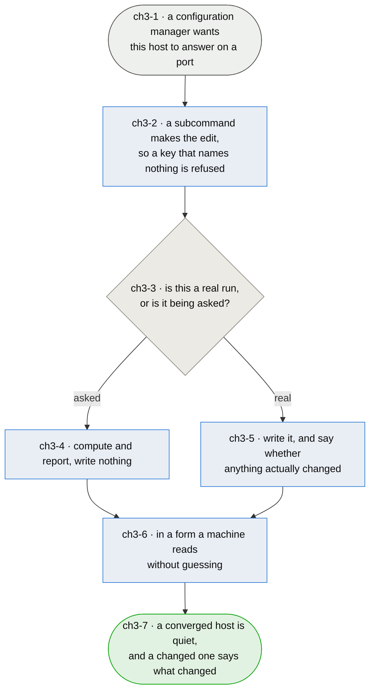

# Chapter 3 — the package tells the truth to whatever configures it

> **As somebody who provisions hosts with a configuration manager I want this firewall to report
> what it actually did, so that a converged host stays quiet and a changed one says so — because a
> tool that cannot tell those apart is one I have to watch by hand, and watching by hand is what I
> bought a configuration manager to stop doing.**

**This is one of the two reasons the package exists**, and it has never been written down. Other
firewalls were rejected not on their filtering but on their administration: they could not be
provisioned cleanly from ansible. That makes "administrable through ansible" a *requirement* here
rather than a nice property, and `ch1-2` already records half of it — the config stays a plain flag
list so a config manager can compose it by appending. This chapter is the other half, and it is the
half that is missing: **being editable is not the same as being honest.**

**Today a service play writes the config with `lineinfile`, and that idiom is honest about change
and dishonest about everything else.** It reports *changed* correctly, which is why fifteen plays
gate an `afirewall reload` on it and a converged host stays quiet. But `lineinfile` will write
anything at all: a play wrote `inbound.tor` for years, a key this package has never had. The task succeeded every time. The line persisted, survived every reload, and opened nothing.
**A key that names no template is invisible precisely because the tool writing it cannot read.**

**So the fix is a subcommand that can refuse — and the trap is that a naive one loses the honesty
`lineinfile` already gives.** `ansible.builtin.command` reports *changed* unconditionally, so
fifteen tasks would fire their reload on every converge of every host, and a quiet run would stop
existing. Gaining a check that catches dead keys is not worth losing the signal that tells an
operator nothing happened. **Both, or neither.**

*Shapes and colours: [legend](legend.md).*



## Story → test trace

| id | node | claim |
|---|---|---|
| `ch3-1` | a configuration manager wants this host to answer on a port | **The consumer is not assumed to be ansible, though ansible is the one that exists.** What a config manager needs from a tool is the same everywhere — refuse what is wrong, report what changed, and answer a question without acting on it — so the interface is a command with machine-readable output rather than an ansible module. A module would serve one consumer better and every other one not at all, and it would put ansible's semantics inside a package that has no other reason to know about ansible |
| `ch3-2` | a subcommand makes the edit | **`afirewall enable <flag>` and `afirewall disable <flag>`, because the command knows what `lineinfile` cannot.** A flag naming a service with no template is refused at the point of writing rather than discovered by an outage — `inbound.tor` survived years of successful converges. This is the same argument as `ch2-4`: the tool asks the question at the moment somebody has the answer. **The plain file stays editable**, per `ch1-2`, so a host carrying an older release is not trapped and a consumer can migrate one play at a time |
| `ch3-3` | is this a real run, or is it being asked? | **A configuration manager asks before it acts, and a tool that cannot be asked makes that mode a lie.** The failure is not theoretical: a `command:` under ansible's `--check` does not run, returns rc 0 with empty stdout, and does *not* leave its register undefined — so a play that reads back what it just did reads a fabricated success, and asserts on it. A dry run has to be a thing the *command* supports, because the alternative is the caller pretending |
| `ch3-4` | compute and report, write nothing | **`--dry-run` does everything except the write**, including refusing an unknown flag. A dry run that skips validation reports success for a change that would have failed, which is worse than not offering one |
| `ch3-5` | write it, and say whether anything actually changed | **Enabling a flag that is already enabled is not a change, and saying so is the whole value.** Fifteen plays gate `afirewall reload` on this signal today; without it every converge reloads the firewall on every host, and "nothing happened" stops being sayable. **Exit status is not where this goes.** Zero means it worked and non-zero means it did not, as everywhere else — an exit code that meant *changed* would break `afirewall enable x && …` for every human at a shell, to save a config manager one parse |
| `ch3-6` | in a form a machine reads without guessing | **One JSON object on stdout, and the reason is a specific trap rather than fashion.** The obvious cheap answer is to print `changed` or `unchanged` and have the caller match on it — and `"changed" in stdout` is **true for `unchanged`**, so the cheap answer silently reports every no-op as a change and the quiet run is lost anyway. A structured object also carries what a plain token cannot: which flag, what it was, what it is now |
| `ch3-7` | a converged host is quiet, and a changed one says what changed | **The measure, and it is an operator's experience rather than a property of the code.** A run that reports changes on a host nothing changed on trains the person reading it to stop reading it, which is the same reason a scheduled all-clear mail is worse than none. Quiet is not cosmetic; it is what makes noise mean something |

## What this looks like from ansible

**Today.** Fifteen tasks of this shape, one per service play:

```yaml
- name: "allow smtp in and out"
  ansible.builtin.lineinfile:
    path: /etc/afirewall/afirewall.conf
    line: "{{ item }}: enable"
    regexp: "^{{ item }}:.*$"
  loop:
    - inbound.smtp
    - outbound.smtp
  register: mail_rules

- name: reload the firewall
  ansible.builtin.command: /usr/sbin/afirewall reload
  when: mail_rules.changed
```

Honest about change — `mail_rules.changed` is why a converged host stays quiet. Silent about
everything else: `inbound.smtpp` would be written, reported as a change, reloaded, and open nothing.

**With the subcommand.** The same task, and the same quiet:

```yaml
- name: "allow smtp in and out"
  ansible.builtin.command:
    argv: "{{ ['/usr/sbin/afirewall', 'enable', item]
             + (['--dry-run'] if ansible_check_mode else []) }}"
  loop:
    - inbound.smtp
    - outbound.smtp
  register: mail_rules
  check_mode: false
  changed_when: (mail_rules.stdout | from_json).changed

- name: reload the firewall
  ansible.builtin.command: /usr/sbin/afirewall reload
  when: mail_rules.changed
```

Three lines longer, and what those three lines buy is that **`inbound.smtpp` fails the play** rather
than being written. `check_mode: false` with an explicit `--dry-run` is the pair that makes a check
run real: the task is allowed to execute, and what it executes is told not to write — instead of
ansible skipping it and the caller reading a fabricated success out of an empty register.

The output it parses:

```json
{"changed": true, "flag": "inbound.smtp", "was": "disable", "now": "enable"}
```

**What has to stay true either way** is the invariant, not the idiom: `afirewall.conf` remains a
plain list of `<flag>: enable` lines, so `lineinfile` keeps working on a host whose package predates
the subcommand, and a consumer that is not ansible is not shut out. The subcommand is a better door,
not the only one (`ch1-2`, `ch3-2`).

## Input → process → output

**Input** — a configuration manager that wants this host to answer on a port (`ch3-1`).

**A subcommand makes the edit** rather than a text-editing module, so a flag naming a service that
has no template is refused where it is written instead of found by an outage (`ch3-2`). If the run
is a question rather than an action, everything happens except the write, validation included
(`ch3-3`, `ch3-4`). Either way the command reports whether anything actually changed (`ch3-5`), as
one JSON object rather than a word another word contains (`ch3-6`).

**Output** — a converged host that is quiet, and a changed one that says what changed (`ch3-7`).

## Open unknowns

- **ch3-U1 — migrating fifteen plays needs every host to have the release first.** `lineinfile`
  works against any version; `afirewall enable` works only where the subcommand exists. The plain
  file staying editable (`ch1-2`, `ch3-2`) is what makes a play-at-a-time migration possible, but
  nothing decides whether that is worth doing at all for plays that are already correct. The
  argument for doing it anyway is that `lineinfile` cannot refuse a dead key, and `inbound.tor` is
  what that costs. Anchored to `ch3-2`.

- **ch3-U2 — an ansible module is deliberately not the answer here, and that could be wrong.**
  `ch3-1` chooses a command with machine-readable output over a module, on the grounds that a module
  serves one consumer and teaches this package ansible's semantics. But a module gets `changed` and
  check mode for free and needs no `changed_when` in fifteen plays, which is real. The position that
  makes both true is a thin module that shells out to the subcommand and parses its JSON — one
  implementation of the logic, two front doors — and nobody has decided whether the packaging cost
  of shipping a module is worth it. Anchored to `ch3-1`.

- **ch3-U3 — nothing here has been measured against a real converge.** The claim that a converged
  host goes quiet is a claim about fifteen plays running twice, and the second run is the evidence.
  It cannot be taken until the configurator's firewall play is part of a run at all. Anchored to `ch3-7`.

## Glossary

| Term | Meaning |
|---|---|
| Flag | A `<direction>.<service>` key selecting a rules template, per `ch1-2` |
| Honest | Reports what it did rather than what it was asked to do — refusing what is wrong, distinguishing a change from a no-op, and answering without acting (`ch3-2`, `ch3-5`, `ch3-3`) |
| Quiet | A converge that reports no change, on a host where nothing changed (`ch3-7`) |
