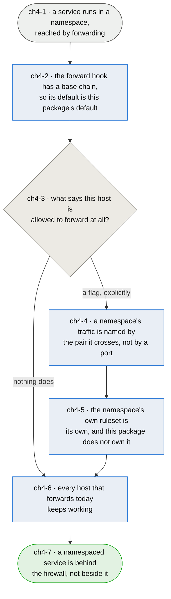

# Chapter 4 — a host that carries namespaces still refuses by default

> **As somebody running services in network namespaces I want the firewall to cover the traffic that
> reaches them, so that putting a service in a namespace is an isolation decision rather than a way
> of stepping outside the firewall without meaning to.**

**SKELETON. Nothing here is decided.** The claims below are the questions this chapter has to
answer, written as claims so the shape of the answer is visible. Every one of them is open, and
several are alternatives rather than a sequence. Do not read this as a design.

**This chapter exists because `ch1-U8` has an expiry date.** afirewall covers a host and not a
router, which is coherent — but the moment a service moves into a network namespace, its traffic
reaches it by being *forwarded*, and the machine is a router for its own services. The decision that
made sense while every service listened on the host stops making sense when some of them do not, and
nothing about the host looks different when it crosses that line.

**And the current default at that hook is the wrong way round.** There is no base chain at
`forward`, so the kernel's default applies and the kernel's default is accept. A package whose whole
posture is `policy drop` in both directions admits everything in the third, silently, on any host
that turns on `ip_forward` — which a container runtime, a tunnel or a namespace will do without
being asked. Whatever this chapter decides, that asymmetry is what it is deciding about.

**The invariants do not move.** Pure nft (`ch1-7`). Administrable through a configuration manager,
with the config a plain flag list something can append to (`ch1-2`, `ch3`). Every rule carrying the
argument for itself (`ch1-6`). A design that satisfies the namespace case by giving up any of those
has answered a different question.

*Shapes and colours: [legend](legend.md).*

## Story → test trace

| id | node | claim |
|---|---|---|
| `ch4-1` | a service runs in a namespace, reached by forwarding | **A namespace makes a host into a router for its own services, and nothing about the host announces that.** The service still belongs to this machine and its operator still thinks of it as running here, but its packets are routed rather than terminated — so every claim this package makes about `input` and `output` stops applying to it. That gap is invisible: the ruleset looks the same, `nft list ruleset` looks the same, and the counters on the sanity chains keep incrementing on the traffic that *is* still terminated |
| `ch4-2` | the forward hook has a base chain | **The asymmetry is the bug, not the missing feature.** `policy drop` in two directions and the kernel's accept in the third is a posture nobody chose, and `ch1-1` says an omitted flag should be a dead service rather than an invisible one. The moment a base chain exists at `forward`, forwarding becomes something a host does deliberately. **What it must not become is something a host does accidentally in the other direction** — a `policy drop` here breaks every machine that forwards today, which is `ch4-6` |
| `ch4-3` | what says this host is allowed to forward at all? | **THE OPEN QUESTION, and the one the rest depends on.** A flag in `afirewall.conf` is the obvious answer and fits `ch1-2` — but a flag is a boolean and forwarding is a relation between two interfaces, so `forward: enable` would be a global accept wearing the word "configured". The alternatives are a flag per interface pair, a flag that only enables forwarding *between named namespaces*, and treating `ip_forward` being on as the opt-in and refusing to be silent about it. None is chosen |
| `ch4-4` | a namespace's traffic is named by the pair it crosses | **A service in a namespace is not a port on this host, so the existing vocabulary does not reach it.** `inbound.postgres` means "this host answers on 5432"; the namespace case means "traffic arriving on the external device for 5432 is forwarded to a veth". Whether that is a new key shape, a new template shape, or a second config file is undecided — and `ch1-2` bounds it: whatever it is, a configuration manager has to be able to compose it by appending single lines |
| `ch4-5` | the namespace's own ruleset is its own | **A network namespace has its own netfilter tables, and this package should almost certainly not reach into them.** Generating a ruleset *inside* a namespace means knowing what runs there, which is the container runtime's job and not a firewall's. The likely position is that afirewall governs the crossing and the namespace governs itself — but "almost certainly" is not a decision, and the case against is that a namespace with no rules of its own is exactly the soft interior this package exists to avoid |
| `ch4-6` | every host that forwards today keeps working | **This is a firewall, so the failure mode of getting it wrong is an outage, and hosts already forward.** A container runtime publishing a port, a tunnel carrying traffic to another machine, a namespace that exists but was never told about — all of them work today because the forward hook is empty. Any chain added there has to be shipped in a posture that does not break them, and the migration from that posture to a refusing one is part of this chapter rather than an afterthought |
| `ch4-7` | a namespaced service is behind the firewall, not beside it | **The measure is that moving a service into a namespace changes its isolation and nothing else.** Not that the ruleset is more complete — that a decision about where a process runs stops being, accidentally, a decision about whether it is filtered |

## Open unknowns

- **ch4-U1 — every claim above is open, and `ch4-3` is the one that gates the others.** What the
  opt-in looks like decides the config vocabulary (`ch4-4`), which decides the template shape, which
  decides whether the existing generator (`ch2`) can produce these at all. Nothing should be built
  until that is settled. Anchored to `ch4-3`.

- **ch4-U2 — no reading has been taken of what a namespaced host's ruleset needs to look like.**
  This chapter is written from the netfilter path rather than from a working example: a namespace
  set up by hand, a service in it, and the minimum rules that let it be reached while the rest still
  refuses. That reading would decide `ch4-4` and `ch4-5` on evidence rather than on reasoning.
  Anchored to `ch4-1`.

- **ch4-U3 — whether this is one chapter or two.** Container runtimes and hand-made namespaces reach
  the same hook by different routes, and a runtime that writes its own rules (`ch1-U6`'s neighbour)
  is a different problem from a namespace nobody else is managing. Treating them together may be
  what makes both intractable. Anchored to `ch4-1`.

## Glossary

| Term | Meaning |
|---|---|
| Namespace | A network namespace: its own interfaces, routes and netfilter tables, reached from the host across a veth pair |
| Crossing | Traffic moving between the host's external device and a namespace, which passes `forward` rather than `input` or `output` (`ch4-1`) |
| Opt-in | Whatever states that a host is allowed to forward, so that forwarding is deliberate rather than a side effect of a sysctl (`ch4-3`) |
