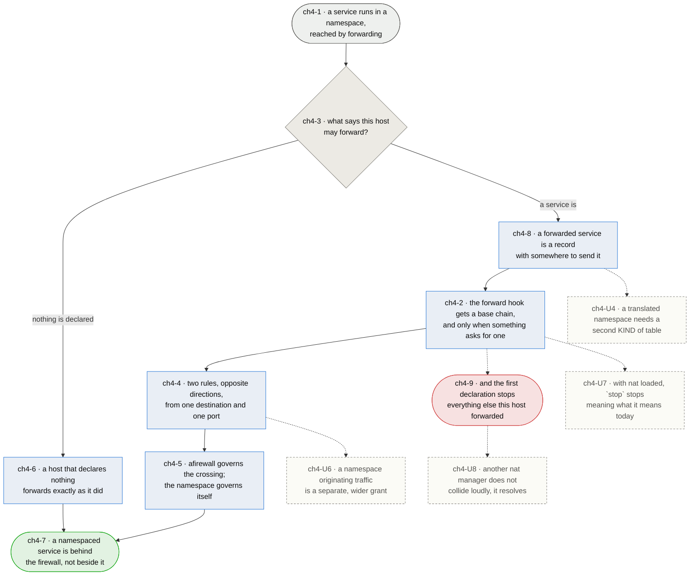

# Chapter 4 — a host that carries namespaces still refuses by default

> **As somebody running services in network namespaces I want the firewall to cover the traffic that
> reaches them, so that putting a service in a namespace is an isolation decision rather than a way
> of stepping outside the firewall without meaning to.**

**This chapter was a skeleton until a reading was taken, and the reading decided it.** `ch4-U2` asked
for a namespace set up by hand, a service in it, and the minimum rules that let it be reached while
the rest still refuses — because everything here had been reasoned from the netfilter path rather
than seen. That was done on 2026-08-17 and it answered three of the four open questions.

**What it found first is the gap itself, measured.** Three namespaces — an outside, a host, a
service behind the host — with afirewall's real ruleset loaded on the middle one. The package
occupies **five chains at `input`, two at `output` and one at `prerouting`, and none at `forward`.**
A connection from the outside to the service reached it and was answered, through a host whose
posture is `policy drop` in both directions. Nothing was misconfigured; the traffic simply never
passes a hook this package has an opinion about.

**Then it found the shape of the answer, which is smaller than the skeleton assumed.** A base chain
at `forward` with `policy drop` and nothing else refuses the service. Adding **two rules** admits it:

```
ip daddr 10.99.0.2 tcp dport 1965 ct state new,established accept
ip saddr 10.99.0.2 tcp sport 1965 ct state established accept
```

Two rules, in opposite directions, different from each other, both derivable from one destination
and one port. **That is the shape [chapter 8](chapter-08-declaration.md) already renders** — it is
what a reply path is, and what DHCP's two halves are. So a forwarded service does not need a new
config vocabulary, a new file, or a flag per interface pair. It needs a record with somewhere to
send the traffic.

**Which settles `ch4-3` by making the question smaller.** Nothing says a host may forward *in
general*, because nothing needs to: the opt-in is a declared service. `forward: enable` was the
obvious answer and is a global accept wearing the word "configured"; an interface pair names
plumbing rather than a service, and `ch1-5` cannot ask who is refused when a limit bites if the
thing being described is a veth.

**A second reading was taken on the translated case, and it made the remaining work smaller and
more separable than "add NAT" suggests.** Same three namespaces, but the outside given no route to
the private range, so it dials the host's own address and a `dnat` rule sends it on.

**The rules this chapter already derives are correct under translation, unchanged.** DNAT runs at
prerouting `-100` and the crossing chain at forward `20`, so the filter chain sees the address the
packet is *going* to rather than the one it arrived for. Measured by counting both: `ip daddr
10.99.0.2` matched **4 packets**, `ip daddr 100.64.0.1` matched **0**. Nothing collides either —
the full order on this host is `FRAGMENTS` (-450), conntrack defrag (-400), conntrack (-200),
`dstnat` (-100), the forward filter (20), `srcnat` (100), so every sanity chain runs before any
translation. **Address translation is additive to this chapter rather than a revision of it.**

**And the crossing pair is one-directional, which was not obvious until it was tried.** With the
inbound crossing declared and nothing else, the service **could not reach out at all**. Traffic a
namespace *originates* is a different flow needing its own two rules, and admitting it is a much
broader grant than admitting a port — so it is `ch4-U6` rather than something `to` should quietly
imply.

**The cost is a cliff, and it is stated rather than smoothed.** With nothing declared this package
emits no chain at `forward`, so every host that forwards today is untouched — that is `ch4-6`, and
it is measured rather than intended. The moment one forwarded service is enabled, a chain appears
with `policy drop`, and everything else this host was forwarding stops. That is a real edge and the
command says so at the point of crossing it, because a firewall that changed a host's forwarding
posture quietly would be the fault this package keeps finding, in a new place.

*Shapes and colours: [legend](legend.md).*



## Story → test trace

| id | node | claim |
|---|---|---|
| `ch4-1` | a service runs in a namespace, reached by forwarding | **A namespace makes a host into a router for its own services, and nothing about the host announces it.** The service still belongs to this machine and its operator still thinks of it as running here, but its packets are routed rather than terminated — so every claim this package makes about `input` and `output` stops applying to it. **Measured 2026-08-17**: with the full ruleset loaded, afirewall held five chains at `input`, two at `output`, one at `prerouting` and **none at `forward`**, and a connection from outside to a service behind the host was reached and answered. The gap is invisible from the host: `nft list ruleset` looks correct and the sanity counters keep incrementing on the traffic that *is* still terminated |
| `ch4-2` | the forward hook gets a base chain, and only when something asks | **The asymmetry is the bug, not the missing feature** — `policy drop` in two directions and the kernel's accept in the third is a posture nobody chose. The chain is emitted **only when a forwarded service is enabled**, which is what lets this be added without breaking hosts that forward today (`ch4-6`). It sits at `hook forward priority 20; policy drop`, the same shape and the same number as the input and output chains, because a reader who has learned one has learned all three |
| `ch4-3` | what says this host may forward? | **A declared service, and nothing else — the question got smaller rather than answered.** `forward: enable` is a global accept wearing the word "configured"; a flag per interface pair names plumbing rather than a service, so `ch1-5` cannot ask who is refused when a limit bites; and treating `ip_forward` as the opt-in makes a sysctl into a security decision. What the reading showed is that the rules needed are per-destination and per-port, so the thing that has to be declared is the service — and a host that declares none is a host that has not opted in |
| `ch4-4` | two rules, opposite directions, from one destination and one port | **Measured, not designed.** A `forward` chain at `policy drop` refused the service; `ip daddr <to> <proto> dport <n> ct state new,established accept` and `ip saddr <to> <proto> sport <n> ct state established accept` admitted it, and nothing else was needed. **Two rules that differ from each other, derived from one record** — which is what chapter 8 already does for a reply path and for DHCP's two halves, so this needs no new vocabulary. **No blanket `ct state established,related accept` in the chain**, for the same reason `ch1-1` refuses one on input: a forwarded service's return path is admitted by that service's own record or not at all |
| `ch4-5` | afirewall governs the crossing; the namespace governs itself | **A network namespace has its own netfilter tables and this package does not reach into them.** Generating a ruleset *inside* a namespace means knowing what runs there, which is the container runtime's job and not a firewall's. The case against — that a namespace with no rules of its own is the soft interior this package exists to avoid — is real and is answered by scope rather than by disagreement: what afirewall can promise is that nothing crosses into that namespace unless a record says so, and what happens after it has crossed belongs to whoever put the service there |
| `ch4-6` | a host that declares nothing forwards exactly as it did | **The compatibility claim, and it is measured rather than intended.** A container runtime publishing a port, a tunnel carrying traffic to another machine, a namespace nobody told the firewall about — all work today because the forward hook is empty, and all keep working, because with no `forward.*` flag enabled this package still emits nothing there. That is why the chain is conditional rather than shipped in a permissive posture and tightened later: there is no migration to run |
| `ch4-7` | a namespaced service is behind the firewall, not beside it | **The measure is that moving a service into a namespace changes its isolation and nothing else** — not that the ruleset is more complete. A decision about where a process runs stops being, accidentally, a decision about whether it is filtered |
| `ch4-8` | a forwarded service is a record with somewhere to send it | **`direction = "forward"` and a `to`, in the catalogue chapter 8 already reads.** The config key is `forward.<name>`, which a configuration manager composes by appending one line exactly as it does the other two directions (`ch1-2`), and the posture and its argument are required of it exactly as they are of an inbound service (`ch1-6`). **A forwarded service is a service** — it terminates somewhere else, and that is the only difference the vocabulary has to carry |
| `ch4-9` | the first declaration stops everything else this host forwarded | **A bad ending accepted deliberately, and announced.** Until a forwarded service is declared this host forwards everything; the moment one is, the chain appears at `policy drop` and every other flow through this machine is refused — a container runtime's published ports above all. There is no posture that avoids this and is still a firewall. What the package owes is that nobody crosses that line without being told, so `afirewall enable forward.<name>` says what it is about to change about traffic it does not otherwise mention |

## Input → process → output

**Input** — a `service` in a namespace, reached by forwarding rather than terminated (`ch4-1`).

**What decides whether this host filters forwarding is whether anything was declared** (`ch4-3`). A
host that declares none keeps the behaviour it has (`ch4-6`); a `record` with a destination
(`ch4-8`) brings a base chain into existence at `forward` (`ch4-2`) and with it the `crossing` —
two rules in opposite directions derived from that one record (`ch4-4`).

**What the namespace does inside itself is its own** (`ch4-5`), and the cost of the first
declaration is that everything this host used to forward silently now does not (`ch4-9`).

**Output** — a namespaced service behind the firewall rather than beside it (`ch4-7`).

## Data definitions

| Element | Type | Card. | Domain | Enforced | Provenance |
| --- | --- | --- | --- | --- | --- |
| `record` | declaration | 0..n | a chapter 8 record with `direction = "forward"` and a `to`, carrying ports, posture and argument like any other (`ch4-8`) | yes — no `to`, no service | authored, in `services.toml` |
| `crossing` | rule pair | 2 per port per record | `ip daddr <to> … dport <n> ct state new,established accept` and `ip saddr <to> … sport <n> ct state established accept`. **Derived, never written** (`ch4-4`) | yes — by there being no second place to write it | derived |
| `forward chain` | base chain | **0 or 1** per family | `hook forward priority 20; policy drop`, and it exists only while some `forward.*` flag is enabled. Zero is the shipped state and the compatibility claim (`ch4-2`, `ch4-6`) | yes | derived |
| `namespace interior` | ruleset | n/a | **out of scope.** afirewall governs the crossing and nothing behind it (`ch4-5`) | — | somebody else's |

## Open unknowns

- **ch4-U4 — the translated case needs a second KIND of table, and that is the whole of what is
  left of it.** This package has only ever emitted `type filter`; a namespace on a private range
  needs `type nat` with a `dstnat` chain on the way in and an `srcnat` chain on the way out. The
  reading above removed the part that looked hardest — the filter rules do not change — and leaves
  three concrete things. **`OWNED_TABLES` grows**, or `stop` leaves a table loaded. **A record has
  to say what the outside dials**: `to` says where traffic goes and DNAT also needs the address and
  port it arrived for, which is the external address this package already discovers, except where a
  service is published on a different external port than its internal one and nothing has decided
  whether that is in scope. **And masquerade needs a source range**, not just the external device —
  `oifname <ext> ip saddr 10.99.0.0/24 masquerade` — and the package has never known what sits
  behind it. One implementation note, learned by hitting it: `dnat` is a reserved word in nft and
  cannot be used as a chain name. Anchored to `ch4-8`.

- **ch4-U6 — a namespace originating traffic is a separate grant, and a much wider one.** Measured:
  with the inbound crossing declared and nothing else, the service could not open a connection
  outward. It needs its own pair — `ip saddr <to> ct state new,established accept` and `ip daddr
  <to> ct state established accept` — and that is not a detail of `ch4-U4`, it is a posture
  decision that stands whether or not translation is ever built. **"This port may be reached" and
  "this namespace may originate anything" are different sentences**, and `ch1-1` is unforgiving
  precisely so that the second is never implied by the first. Whether it is a field on the record,
  a separate direction, or a set of destinations the namespace may reach is undecided; what is
  decided is that `to` must not quietly mean both. Anchored to `ch4-4`.

- **ch4-U7 — with nat tables loaded, `stop` stops meaning what it means today.** Right now `stop`
  removes filtering and the host still routes: a smaller firewall, not a broken host. Remove a
  translation table and every published service stops resolving at once, and a host may begin
  putting un-masqueraded private source addresses on the wire — which is not a weaker posture but a
  different and noisier failure. The verb is netfilter-persistent's and arrives from the system, so
  this is not a question anybody gets asked at the time. Whether `stop` should refuse while
  translation is loaded, tear both down together, or keep the nat tables and drop only the filters
  is undecided, and it is worth deciding **before** the tables exist rather than after. Anchored to
  `ch4-2`.

- **ch4-U8 — a host with another nat manager already has DNAT rules, and first match wins.** A
  container runtime writes its own translation at the same hook this would use. `ch4-9` covers the
  filtering half of that collision and says the operator must choose; the translating half is
  worse, because two managers do not produce a refusal but a *resolution* — a service silently
  pointing at the wrong container rather than at nothing. This is `ch1-7`'s "two front ends fight"
  in the one place where the losing outcome is quiet. Anchored to `ch4-9`.

- **ch4-U5 — nothing decides what a forwarded service's limit means.** `ch1-5` asks who is refused
  when a limit bites, and for a forwarded service the answer has an extra party in it: the host
  imposing the limit is not the host being protected. A rate limit on a crossing spends an allowance
  belonging to a service the operator may not administer, and the collateral of a wrong drop lands
  on somebody else's process. The posture and its argument are required of these records like any
  other, so the question is asked — what is undecided is whether the existing three answers are the
  right ones to choose between. Anchored to `ch4-4`.

- **ch4-U2 — RESOLVED, and it decided this chapter.** The reading it asked for was taken on
  2026-08-17: three namespaces, afirewall's real ruleset on the middle one, and a service behind it.
  It measured the gap (`ch4-1`), found the minimum rules (`ch4-4`), and showed that the vocabulary
  chapter 8 already has is enough — which is what turned `ch4-3` from a choice between four bad
  options into a smaller question with an obvious answer.

- **ch4-U3 — RESOLVED: one chapter.** Container runtimes and hand-made namespaces reach the same
  hook by different routes, and the worry was that treating them together made both intractable.
  The conditional chain separates them without needing to: a runtime that manages its own
  forwarding declares nothing here, so this package emits nothing and does not contend with it
  (`ch4-6`). What the two share is `ch4-9`, and a host doing both has to choose — which is a
  statement this chapter can make rather than a problem it has to solve.

## Glossary

| Term | Meaning |
|---|---|
| Namespace | A network namespace: its own interfaces, routes and netfilter tables, reached from the host across a veth pair |
| Crossing | Traffic moving between the host's external device and a namespace, which passes `forward` rather than `input` or `output`. The two rules that admit one are derived from a single record (`ch4-1`, `ch4-4`) |
| Opt-in | A declared forwarded service. There is no host-level switch, because the rules a crossing needs are per-destination and per-port and a boolean cannot say either (`ch4-3`) |
| Routed namespace | One whose address is reachable from outside without translation. The case this chapter covers; the translated case is `ch4-U4` |
