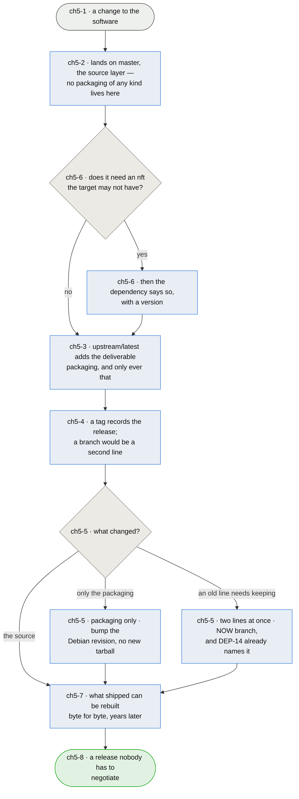

# Chapter 5 — a release is a linear pass with nothing to negotiate

> **As the person cutting a release I want the branches to have nothing to disagree about, so that
> shipping is a sequence of steps rather than a reconciliation — and so that a version I shipped a
> year ago can still be rebuilt from what is in the repository.**

**This chapter was written because a release conflicted.** Merging `master` into `upstream/latest`
stopped on three files — `README.md`, `doc/man/afirewall.8` and `pyproject.toml`, two of them
`add/add` — which is the signature of **a layer being authored on for files it does not own**.
`upstream/latest` carried 26 non-merge commits `master` had never seen: a manpage, version bumps,
"Update project, and website. Added save command".

**20260816.0.0 was cut against this chapter and it held.** Two conflicts rather than three, both
answered on merit rather than by picking a side — `README.md` keeps a Description section only the
packaging layer had, and the manpage takes master's, which is the one that documents
`add-service`. The one question that came up was answered by the chapter rather than by a
judgement: the manpage was out of date, and fixing it during the merge would have been authoring a
source change on the packaging layer, so the merge was abandoned, the fix made on `master`, and the
merge redone. That is `ch5-3` doing its job before a drill had to.

**The branches are three layers and each one adds what the next needs.** `master` is the source.
`upstream/latest` adds what makes it **deliverable** — the Python packaging, which is why
`hatch.toml` and `pyproject.toml` live there and not on master. `debian/latest` adds what makes it
a **Debian package**. `47658bf Removed packaging files` was that boundary being drawn, not a
mistake, and keeping it is what lets the source move without a packaging decision attached to every
change.

**So a layer IS authored on — that is what makes it a layer rather than a destination — and the rule
is that it is authored on for its own files and nothing else.** That is where this went wrong.
Alongside the six commits that legitimately maintain the Python packaging, `upstream/latest` carries
`Adding man page for afirewall`, `Update project, and website. Added save command`, `Updated for
release 20240921.0.2`. A **source** change — a `save` command — was made on the packaging layer, and
master never got it. The boundary was right and porous.

**But the reason those lines were anticipated is real, and it is not the one you would guess.**
It is not Python and it is not architecture: this package is `Architecture: all` and pure Python, and
one build serves every suite. **It is `nft`.** What this package ships is a *generator*, and what has
to parse is its output — on the target's version of nftables, which is 1.0.6 on bookworm and 1.1.3
on trixie. The templates already use `typeof` in set definitions, `ct count`, dynamic sets and
`meta skuid`, none of which have always existed. Namespaces (`ch4`) will raise that floor again. So
a second line is a real prospect, and the thing that makes it necessary is a *dependency*, not a
suite name.

**Which made the missing declaration the urgent part.** `Depends:` said `nftables` with no version
at all: a host with an older nft installed the package successfully and then failed to load a
ruleset — at `afirewall start`, on a machine that now had no firewall. It says `>= 1.0.2` now, and
the number was measured rather than reasoned (`ch5-U1`). **The construct that draws the line is not
one of the ones above** — it is `tcp flags urg / urg,ack`, and every feature that looked riskier
parses on nft 0.9.3.

*Shapes and colours: [legend](legend.md).*

## Story → test trace

| id | node | claim |
|---|---|---|
| `ch5-1` | a change to the software | **The release process is a property of the repository, not of the person running it.** A sequence somebody has to remember is a sequence somebody gets wrong at the version they most need to reproduce — and this repository has already lost a manpage, a set of version bumps and a `save` command onto a branch nobody merges from, each of them a step somebody skipped. So it is `tools/release.sh`, and the drill asserts every phase this chapter claims is actually in it: the two merges, both tags, the Debian revision, the pristine-tar commit, the archive include, and a `--publish` that has to be asked for. **The drill does not claim the script is good** — it claims the file and the chapter cannot drift apart while both look maintained |
| `ch5-2` | lands on master, and each layer adds only what it owns | **Three layers, and the boundaries are the design rather than an accident of history.** `master` holds the source — `LICENSE`, `README.md`, `doc/`, the templates, the code. `upstream/latest` adds the four files that make it deliverable as a Python project: `DESCRIPTION.txt`, `LICENSE-SHORT.txt`, `pyproject.toml`, `hatch.toml`. `debian/latest` adds `debian/`. **Master carrying none of it is the point** — the source moves without a packaging decision attached to every change — and a drill asserts both directions, that `debian/` never appears on master and that `upstream/latest` adds the declared four and nothing else. Collapsing the boundary is not hypothetical: doing it gave the licence file two names and two homes, and it is what a later reader will do again unless something refuses |
| `ch5-3` | a layer is authored on, for its own files only | **The rule is not that `upstream/latest` has no commits of its own — it must have them, or it is not a layer.** It is that every one touches only what that layer owns. Of the 26 commits master has never seen, six do exactly that and the rest do not: a manpage, a website change, and a `save` command, all authored on the packaging branch and never reaching the source. **That is what a porous boundary costs**, and it is the whole explanation for the licence confusion and for a `pyproject.toml` that could not be edited from `debian/latest` without `dpkg-source` refusing the build. The drill is scoped to commits **since the newest release tag**: before it the rule was broken, and a permanently red drill teaches nobody anything, while "it has not happened since" is a thing somebody can still act on. **That scoping needs a second drill beside it, and finding out cost a release.** A question about commits since a boundary is blind to what earlier straying LEFT BEHIND — and every release moves the boundary, so a violation that survives one cut becomes permanently invisible. `requirements.txt` was authored here in April 2025, fell behind the boundary, and sat diverged for sixteen months until both layers moved in one release and it conflicted. So the second drill asks about **state instead of history**: no file outside the declared set may DIFFER between the layers, which is a question about now and cannot be aged out. The two are halves of one boundary being real — a repository can pass either while failing the other |
| `ch5-4` | a tag records the release | **A release is remembered by `upstream/latest/<version>` and `debian/latest-<version>-<rev>`, not by a branch.** A branch invites commits; a tag cannot receive them. Every release branch this repository made — three of them — had to be merged home, and the drift is what happened when one was not. A tag says what shipped without offering anywhere to put something new |
| `ch5-5` | what changed? | **Three kinds of change and only one needs a branch.** New source is a new upstream version, tagged, linear. A packaging-only fix — a wrong dependency, a bad `.install` line — is a **Debian revision**: `-1` to `-2`, no new upstream version, no new tarball, pristine-tar untouched. **This is what the native format was costing**, because a native package has no revision, so every packaging fix forced a fake upstream release. Only genuinely maintaining two lines at once needs a branch, and DEP-14 already names it: the `/latest` in `debian/latest` and `upstream/latest` is the slot `debian/bookworm` and `upstream/1.x` go beside |
| `ch5-6` | does it need an nft the target may not have? | **The generated ruleset is the artifact, and it has to parse on the target's nftables.** That makes nft's *version* a dependency of the output rather than of the code, which is the one this package had forgotten entirely: `Depends:` named `nftables` with no version at all, so a host with an older one installed cleanly and then failed at `afirewall start` — with no firewall, which is the worst moment to discover a dependency. **The floor is measured, not reasoned** (`ch5-U1`): a full ruleset through `nft -c` on five versions, failing on 0.9.3 and 0.9.8, parsing on 1.0.2, 1.0.6 and 1.1.3. Reading changelogs would have produced the wrong number from the right list of features, because the construct that draws the line is `tcp flags urg / urg,ack` rather than anything that looked risky. **This is also the real reason a second line may be needed** (`ch5-5`), and the reason it will be needed sooner once namespaces land |
| `ch5-7` | what shipped can be rebuilt byte for byte | **A release nobody can reproduce is a release you cannot debug.** `3.0 (quilt)` plus pristine-tar means the exact `.orig.tar.gz` is regenerable from git years later, so a bug report against an old version can be built and stepped through rather than guessed at. Verified round-trip rather than assumed: `pristine-tar checkout` reproduced `20260815.0.0` at the same SHA256 as the tarball gbp generated |
| `ch5-8` | a release nobody has to negotiate | **A release that looks complete and is not is the failure this chapter exists to prevent, and it happened on 20260816.2.0-1.** A bare `git push` in the archive needed upstream tracking it did not have; the push errored, `set -e` ended the script there, and the branch and tag push below it never ran. Archive updated, package built, both tags made, drills green — and nothing public. The script pushes with explicit refspecs now and, more to the point, **asks the remote what it has** before saying it is done: an exit code is what the broken version trusted. **The measure is that cutting a release answers no questions** — not that it is automated, but that no step requires deciding which branch was right, which licence file wins, or whether a version bump belongs here or there. Every one of those has been decided at least once in this repository's history, differently each time. What a clean run leaves behind is checkable: a version, tagged in both places, with a tarball anybody can regenerate. **Read from the repository and not from the archive**, because whether a package is fetchable depends on a CDN, and a drill that reddens over a cached index has taught nobody anything about the release |

## Input → process → output

**Input** — a change to the software (`ch5-1`).

**It lands on master**, the source layer, which carries no packaging of any kind (`ch5-2`) — and if
it needs an nft feature the target may not have, the dependency says so with a version (`ch5-6`).
`upstream/latest` takes master and adds the four files that make it deliverable, which is the only
thing ever authored there (`ch5-3`); `debian/latest` takes that and adds `debian/`. A tag records
what shipped (`ch5-4`), the kind of change decides whether anything branches at all (`ch5-5`), and
what ships stays rebuildable (`ch5-7`).

**Output** — a release nobody has to negotiate (`ch5-8`).

## Open unknowns

- **ch5-U4 — every "has not happened since" drill in this repository has the same blind spot.**
  `ch5-3`'s history half was scoped to the newest release tag for a good reason and acquired a
  state-checking sibling on 2026-08-17 because the scoping hid a real divergence for sixteen
  months. The generalisable part is not about branches: **a drill that forgives what came before a
  moving boundary cannot see what that history left in the tree**, and the boundary moves every
  time the thing it is anchored to happens again. Nothing has swept this repository's other drills
  for the shape — `undrilled`'s unwatched set is the obvious neighbour, since "nobody has taken
  this reading" is also a statement about history that says nothing about now. Anchored to `ch5-3`.

- **ch5-U1 — MEASURED 2026-08-16, and the answer was not the feature anybody would have guessed.**
  A ruleset with every flag enabled, both families, through `nft -c` on five versions: **0.9.3 and
  0.9.8 fail with a syntax error; 1.0.2, 1.0.6 and 1.1.3 parse.** The construct that draws the line
  is `tcp flags urg / urg,ack` — the symbolic flag/mask form in `INVALID_FLAGS` — and not `typeof`
  in a set definition, `ct count`, dynamic sets or `meta skuid`, all of which pass on 0.9.3. Reading
  changelogs would have produced the wrong number from the right list.

  `Depends: nftables (>= 1.0.2)` is the oldest version measured to accept the whole ruleset. 0.9.9
  through 1.0.1 are untested and the constraint claims nothing about them: one release too strict
  costs a host that would have worked, one too loose costs a host its firewall, and the asymmetry
  decides which way to round.

  **What this does not settle is the same question asked again later.** Every template added from
  here can raise the floor, and nothing re-measures it — which is `ch5-U4`.

- **ch5-U2 — RESOLVED, and what resolved it was being told the design.** The plan had been to
  reconcile master and `upstream/latest` into agreement, on the assumption that `upstream/latest`
  should hold nothing of its own. That assumption was wrong: the branches are layers, and the
  deliverable packaging belongs one layer out from the source *by design*. The reconciliation was
  therefore not a merge at all — it was putting `DESCRIPTION.txt`, `LICENSE-SHORT.txt` and
  `pyproject.toml` back where they belong and making the fixes to them on the branch that owns them.

  **The invariant changed with it.** "master and upstream agree" was never true and was never meant
  to be — master is ahead between releases, which is the model working. What holds instead is that
  each layer adds only what it owns, checked as state (`ch5-2`) and as recent history (`ch5-3`).
  A trial merge conflicted on three files, and only one of the three was master's to win outright:
  `README.md` needed content from both sides, which a "master wins" reconciliation would have
  silently discarded.

- **ch5-U4 — CLOSED BY A DRILL RATHER THAN BY A DECISION.** The worry was that `ch5-U1` measured
  the floor once, so a template added later could raise it while `debian/control` went on claiming
  1.0.2 — the templates would render, this workstation's nft would accept them, and nothing would
  say otherwise. It is now re-measured on every run: the drill reads the floor out of
  `debian/control`, obtains an nft of that exact version, renders a full ruleset and parses it
  there. **The floor is checked against the templates rather than remembered about them.**

  A red is not a fault to explain away, it is the question `ch5-6` exists to ask, and it has two
  honest answers and no third: change the template so it parses at the declared floor, or raise the
  floor to the oldest version that takes the template. Raising it drops hosts that were working;
  changing the template keeps them. The drill says exactly that when it fires, and it was proved to
  fire — the floor was set to 0.9.8 deliberately and it named the five offending lines.

- **ch5-U3 — nothing decides when a second line actually starts.** `ch5-5` says a branch is for
  maintaining two lines at once and `ch5-6` says nft is what will force one, but not at which point:
  when a template needs syntax bookworm's nft cannot parse, when namespaces land, or when somebody
  reports a failure. Starting a line early costs maintenance on a branch nobody needs; starting it
  late means the break is discovered by a user. Anchored to `ch5-5`.

## Glossary

| Term | Meaning |
|---|---|
| Line | A maintained series of releases — `latest` today, `1.x` or `bookworm` if one is ever needed (`ch5-5`) |
| Destination branch | A branch that only ever receives merges: `upstream/latest`, `debian/latest` (`ch5-3`) |
| Debian revision | The `-N` after the upstream version, for changes to packaging alone (`ch5-5`) |
| nft floor | The oldest nftables that can load a full generated ruleset (`ch5-6`, `ch5-U1`) |
