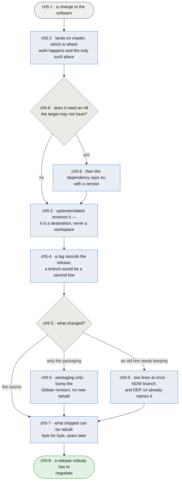

# Chapter 5 — a release is a linear pass with nothing to negotiate

> **As the person cutting a release I want the branches to have nothing to disagree about, so that
> shipping is a sequence of steps rather than a reconciliation — and so that a version I shipped a
> year ago can still be rebuilt from what is in the repository.**

**This chapter exists because a release currently conflicts.** Merging `master` into
`upstream/latest` today stops on three files — `README.md`, `doc/man/afirewall.8` and
`pyproject.toml`, two of them `add/add`. That is not a merge going wrong; it is the signature of
**work having been authored on a branch whose job was to receive it**. `upstream/latest` carries 26
non-merge commits `master` has never seen: a manpage, version bumps, "Update project, and website",
"Removed dist files".

**The cause was a reasonable instinct applied to the wrong problem.** Each release got its own
branch — `upstream/latest-20250429.0.0`, `upstream/latest-20260815.0.0`, a pull request from
`upstream/latest-20290421.0.3` — merged from master and then back. That shape is correct when you
are *maintaining several lines at once*. For a single linear release it adds a branch per version
that has to find its way home, and some of it did not.

**But the reason those lines were anticipated is real, and it is not the one you would guess.**
It is not Python and it is not architecture: this package is `Architecture: all` and pure Python, and
one build serves every suite. **It is `nft`.** What this package ships is a *generator*, and what has
to parse is its output — on the target's version of nftables, which is 1.0.6 on bookworm and 1.1.3
on trixie. The templates already use `typeof` in set definitions, `ct count`, dynamic sets and
`meta skuid`, none of which have always existed. Namespaces (`ch4`) will raise that floor again. So
a second line is a real prospect, and the thing that makes it necessary is a *dependency*, not a
suite name.

**Which made the missing declaration the urgent part.** `Depends:` said `nftables` with no version
at all: a host with an older nft installed the package successfully and then failed to load a
ruleset — at `afirewall start`, on a machine that now had no firewall. It says `>= 1.0.2` now, and
the number was measured rather than reasoned (`ch5-U1`). **The construct that draws the line is not
one of the ones above** — it is `tcp flags urg / urg,ack`, and every feature that looked riskier
parses on nft 0.9.3.

*Shapes and colours: [legend](legend.md).*

## Story → test trace

| id | node | claim |
|---|---|---|
| `ch5-1` | a change to the software | **The release process is a property of the repository, not of the person running it.** A sequence somebody has to remember is a sequence somebody gets wrong at the version they most need to reproduce — and this repository has already lost a manpage, a set of version bumps and a website change onto a branch nobody merges from. Recording it is worth less than making it checkable, which is why every claim below has a drill that reads the branches rather than a document that describes them |
| `ch5-2` | lands on master, and master carries the source plus a named few | **`master` is the only branch anybody commits to, and it holds the software AND the files that describe it** — `LICENSE`, `README.md`, `doc/`, and the templates. What it must *not* hold is `debian/`, because that is Debian's opinion of the software rather than the software, and keeping it off master is what lets master move without a packaging decision attached. **`upstream/latest` may differ from master by a declared, short list and nothing else** (`DESCRIPTION.txt`, `pyproject.toml` — the Python packaging), so the difference is a fact somebody chose rather than a residue. A drill enforces the list, which is what makes "master moves away from the packaging" a rule instead of an intention |
| `ch5-3` | upstream/latest is a destination, never a workspace | **Nothing is authored on a branch whose job is to receive.** `upstream/latest` currently holds 26 non-merge commits master has never seen, and that single fact explains the three-way licence confusion, the `pyproject.toml` that could not be edited without breaking `dpkg-source`, and the conflicts a release hits today. The rule is checkable in one command — `git log upstream/latest ^master --no-merges` must be empty — and it is the rule the whole chapter rests on |
| `ch5-4` | a tag records the release | **A release is remembered by `upstream/latest/<version>` and `debian/latest-<version>-<rev>`, not by a branch.** A branch invites commits; a tag cannot receive them. Every release branch this repository made — three of them — had to be merged home, and the drift is what happened when one was not. A tag says what shipped without offering anywhere to put something new |
| `ch5-5` | what changed? | **Three kinds of change and only one needs a branch.** New source is a new upstream version, tagged, linear. A packaging-only fix — a wrong dependency, a bad `.install` line — is a **Debian revision**: `-1` to `-2`, no new upstream version, no new tarball, pristine-tar untouched. **This is what the native format was costing**, because a native package has no revision, so every packaging fix forced a fake upstream release. Only genuinely maintaining two lines at once needs a branch, and DEP-14 already names it: the `/latest` in `debian/latest` and `upstream/latest` is the slot `debian/bookworm` and `upstream/1.x` go beside |
| `ch5-6` | does it need an nft the target may not have? | **The generated ruleset is the artifact, and it has to parse on the target's nftables.** That makes nft's *version* a dependency of the output rather than of the code, which is the one this package had forgotten entirely: `Depends:` named `nftables` with no version at all, so a host with an older one installed cleanly and then failed at `afirewall start` — with no firewall, which is the worst moment to discover a dependency. **The floor is measured, not reasoned** (`ch5-U1`): a full ruleset through `nft -c` on five versions, failing on 0.9.3 and 0.9.8, parsing on 1.0.2, 1.0.6 and 1.1.3. Reading changelogs would have produced the wrong number from the right list of features, because the construct that draws the line is `tcp flags urg / urg,ack` rather than anything that looked risky. **This is also the real reason a second line may be needed** (`ch5-5`), and the reason it will be needed sooner once namespaces land |
| `ch5-7` | what shipped can be rebuilt byte for byte | **A release nobody can reproduce is a release you cannot debug.** `3.0 (quilt)` plus pristine-tar means the exact `.orig.tar.gz` is regenerable from git years later, so a bug report against an old version can be built and stepped through rather than guessed at. Verified round-trip rather than assumed: `pristine-tar checkout` reproduced `20260815.0.0` at the same SHA256 as the tarball gbp generated |
| `ch5-8` | a release nobody has to negotiate | **The measure is that cutting a release answers no questions.** Not that it is automated — that no step requires deciding which branch was right, which licence file wins, or whether a version bump belongs here or there. Every one of those decisions has been made at least once in this repository's history, differently each time |

## Input → process → output

**Input** — a change to the software (`ch5-1`).

**It lands on master** (`ch5-2`), which is the only branch anybody commits to, and if it needs an
nft feature the target may not have, the dependency says so with a version (`ch5-6`).
`upstream/latest` receives master rather than being worked on (`ch5-3`), a tag records what shipped
(`ch5-4`), and the kind of change decides whether anything branches at all (`ch5-5`). What ships
stays rebuildable (`ch5-7`).

**Output** — a release nobody has to negotiate (`ch5-8`).

## Open unknowns

- **ch5-U1 — MEASURED 2026-08-16, and the answer was not the feature anybody would have guessed.**
  A ruleset with every flag enabled, both families, through `nft -c` on five versions: **0.9.3 and
  0.9.8 fail with a syntax error; 1.0.2, 1.0.6 and 1.1.3 parse.** The construct that draws the line
  is `tcp flags urg / urg,ack` — the symbolic flag/mask form in `INVALID_FLAGS` — and not `typeof`
  in a set definition, `ct count`, dynamic sets or `meta skuid`, all of which pass on 0.9.3. Reading
  changelogs would have produced the wrong number from the right list.

  `Depends: nftables (>= 1.0.2)` is the oldest version measured to accept the whole ruleset. 0.9.9
  through 1.0.1 are untested and the constraint claims nothing about them: one release too strict
  costs a host that would have worked, one too loose costs a host its firewall, and the asymmetry
  decides which way to round.

  **What this does not settle is the same question asked again later.** Every template added from
  here can raise the floor, and nothing re-measures it — which is `ch5-U4`.

- **ch5-U2 — the divergence has to be reconciled before any of this holds.** `upstream/latest` is
  36 commits ahead and 13 behind master, and a trial merge conflicts on three files. Master's side
  is the newer one on all three, so the reconciliation is not a judgement call — but whether to
  resolve the merge or reset `upstream/latest` to master outright is, because the second discards a
  history that the release tags no longer need. Anchored to `ch5-3`.

- **ch5-U4 — the floor is measured once and can move under any template.** `ch5-U1` established
  `>= 1.0.2` for the ruleset as it stands on 2026-08-16. A service added by `afirewall add-service`
  (`ch2`), or anything the namespace work needs (`ch4`), can require newer syntax and nothing would
  notice: the templates would render, this workstation's nft would accept them, and the constraint
  in `debian/control` would keep claiming 1.0.2. The reading is cheap and containerised, so the
  question is whether it belongs in the release sequence or in whatever runs the drills. Anchored
  to `ch5-6`.

- **ch5-U3 — nothing decides when a second line actually starts.** `ch5-5` says a branch is for
  maintaining two lines at once and `ch5-6` says nft is what will force one, but not at which point:
  when a template needs syntax bookworm's nft cannot parse, when namespaces land, or when somebody
  reports a failure. Starting a line early costs maintenance on a branch nobody needs; starting it
  late means the break is discovered by a user. Anchored to `ch5-5`.

## Glossary

| Term | Meaning |
|---|---|
| Line | A maintained series of releases — `latest` today, `1.x` or `bookworm` if one is ever needed (`ch5-5`) |
| Destination branch | A branch that only ever receives merges: `upstream/latest`, `debian/latest` (`ch5-3`) |
| Debian revision | The `-N` after the upstream version, for changes to packaging alone (`ch5-5`) |
| nft floor | The oldest nftables that can load a full generated ruleset (`ch5-6`, `ch5-U1`) |
