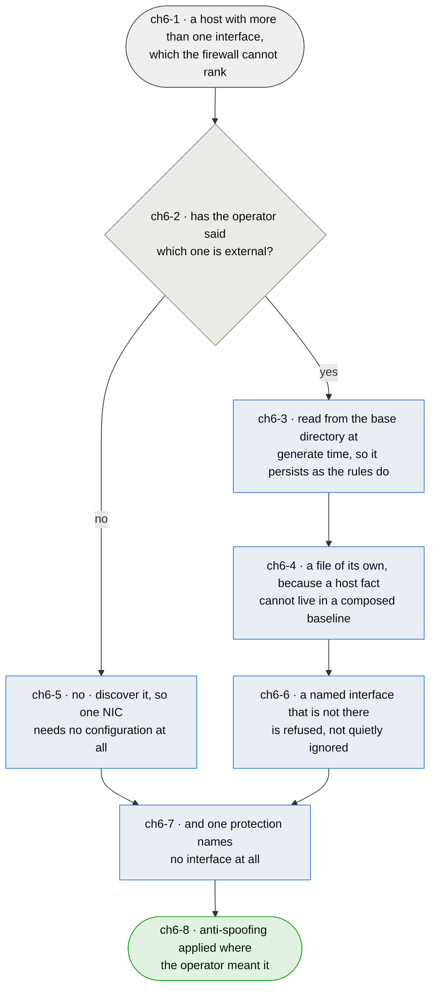

# Chapter 6 — which network this host does not trust is stated, not guessed

> **As somebody with more than one interface I want to say which one faces the untrusted network,
> so that the anti-spoofing rules land where I meant them — and I want a host with one interface to
> keep working without me saying anything at all.**

**This package is alone in inferring it.** It finds the external interface by asking which one the
default route uses. Read out of the two firewalls most people meet: `ufw` does not ask the question
at all — no interface discovery anywhere in it, no source-based anti-spoofing, not even an
`rp_filter` setting — and instead drops anything not addressed to this host, which needs no
interface to be named. `firewalld` requires an answer: nine zones, one of them called `external`, a
`DefaultZone` of `public`, and no discovery code. **One sidesteps the question and the other makes
you answer it.**

**The reason to change is not tidiness.** Measured on eight hosts, the default route is on the
physical NIC every time, so today the guess is right. Every one of those hosts also carries a
`wg0`, and one `AllowedIPs = 0.0.0.0/0` moves the default route onto it. Discovery then returns the
tunnel as external, the anti-spoofing rules are applied to the **overlay** — where a private source
is entirely legitimate — and **not** to the NIC where it would be forged. Backwards, silent, and
one config line away on every host in the hosts.

**A better heuristic does not exist.** "The interface whose address is globally routable" fails on a
NAT'd VPS, whose only interface is external and privately addressed. Trust is a policy statement
about a network, and a routing table is not a trust database. So the answer is firewalld's, at
afirewall's scale: the operator says it, and discovery remains the default for the single-NIC host
this was written for.

**And where it is stated is decided by how it has to persist.** It must load and unload with the
rules, which rules out everything that is not an input to generation: a command-line flag would not
survive `netfilter-persistent` invoking the plugin at boot, and a unit drop-in or an environment
file would be a second persistence mechanism beside the one the package already has. **A file in the
base directory is the only shape that persists the way the rules do**, because it is read at the
moment the rules are generated, exactly as `afirewall.conf`, `templates/` and `lists/` are.

*Shapes and colours: [legend](legend.md).*

## Story → test trace

| id | node | claim |
|---|---|---|
| `ch6-1` | a host with more than one interface | **The measurement is the argument.** Eight hosts, two to five interfaces each — `ens6`, `wg0`, `docker0`, bridges, veths — and the `SPOOFING` chain names exactly one of them. Excluding the tunnel is deliberate and was a fix in its own right, but the model that encodes is *a host has one external interface*, and these hosts do not. The kernel is not a fallback either: every interface carries `rp_filter=2`, which is **loose** reverse-path filtering and drops only sources unreachable by any route, and **there is no IPv6 rp_filter at all** — so for IPv6 the firewall is the only place this can live |
| `ch6-2` | has the operator said which one is external? | **Trust is policy and the routing table is not a trust database.** The default route says where packets go, not which network is hostile; they coincide on a single-NIC VPS and diverge the moment a full-tunnel VPN exists, which is one `AllowedIPs` away on every host measured. `firewalld` reaches the same conclusion with zones and `ufw` avoids needing it at all — neither guesses, and a guess that is right today because of how a host happens to be routed is not a property anybody can rely on |
| `ch6-3` | read from the base directory at generate time | **How it persists decides where it lives, and that rules out most of the options.** It has to load and unload with the rules. A command-line flag does not survive `netfilter-persistent` running the plugin at boot with no arguments. A systemd drop-in or an environment file would be a second persistence mechanism beside the one this package already has, and two mechanisms is how a host ends up with a firewall that disagrees with its own configuration. A file in the base directory is read at the moment the rules are generated, exactly as `afirewall.conf`, `templates/` and `lists/` are, so it persists by the same means and needs nothing new |
| `ch6-4` | a file of its own | **It cannot go in `afirewall.conf`, and the reason is the consumer rather than the format.** That file is composed by appending service flags — `ch1-2` — and a configuration manager restores **one baseline shared by every host** before each run so the end state follows from which roles ran. The external interface is a *per-host* fact: put it there and either the restore erases it every converge, or the baseline stops being one file. `firewalld` reaches the same separation from the other direction, keeping zone assignment out of the service definitions |
| `ch6-5` | no · discover it | **A host with one interface must still need no configuration.** That is what the package is for, and the discovery it already does is right for it — measured right on eight hosts out of eight. Silence means *use the default route*, which keeps every existing installation working unchanged and makes this feature cost nothing to the people who do not need it |
| `ch6-6` | a named interface that is not there is refused | **The failure mode of a wrong statement must not be a silently misapplied rule**, which is the entire complaint against guessing. If the file names an interface the host does not have, generation stops and says so — it does not fall back to discovery, because a fallback would turn a typo into the exact silent wrongness this chapter exists to remove. Loud and refusing beats quiet and plausible |
| `ch6-7` | and one protection names no interface at all | **`ufw`'s check, taken alongside rather than instead** — a drop for anything not addressed to this host, `fib daddr type` in nft, what `addrtype --dst-type LOCAL` does for ufw. **The claim here is narrower than this row first made it**, and writing the rule is what showed that: it does *not* compensate for a wrongly stated interface, because a spoofed packet is still addressed to us and passes it. What is true is that it needs no interface named, so its correctness does not depend on the trust statement being right — two protections, not a protection and its fallback. One asks whether a source could have arrived where it did; the other whether the packet was ever for us. It carries a named counter, because on a normal host the routing decision has already sent everything addressed elsewhere to the forward hook, and a drop rule that never fires looks exactly like one that is working |
| `ch6-8` | anti-spoofing applied where the operator meant it | **The measure is that a host with a tunnel, a bridge and a NIC filters the NIC** — not that the configuration is richer. A firewall that protects the wrong interface is worse than one that protects none, because the first is believed |

## Input → process → output

**Input** — a host with more than one interface, which the firewall cannot rank by trust (`ch6-1`).

**If the operator has said which is external** (`ch6-2`), that is read from the base directory at
generate time so it persists exactly as the rules do (`ch6-3`), from a file of its own rather than
from the composed service configuration (`ch6-4`). **If they have not**, it is discovered from the
default route, so a single-NIC host needs no configuration at all (`ch6-5`). A named interface that
does not exist stops the run rather than falling back (`ch6-6`), and a check that needs no interface
named runs beside all of it (`ch6-7`).

**Output** — anti-spoofing applied where the operator meant it (`ch6-8`).

## Open unknowns

- **ch6-U1 — one external interface or several, and what else is worth naming.** A host with two
  uplinks has two, and today more than one is refused rather than silently reduced to the first.
  What is undecided is the vocabulary: `firewalld` has nine zones and this package has one
  distinction, and the gap between them is a design this chapter deliberately does not take.

  **Namespaces are where that gets answered, not here** (`ch4`). A service in a namespace is reached
  by *forwarding* from the external NIC to the host end of a veth, so the host acquires interfaces
  whose role is neither external nor irrelevant — and a model that only asks "which one is external"
  has nothing to call them. Two things were done now so that chapter does not have to undo them:
  the file is `<role>: <device>` rather than a bare list of devices, so another role is additive
  rather than a reshape; and an unrecognised role is refused with a message saying the vocabulary is
  *closed*, not that the line is wrong — so adding one is a visible decision instead of something
  that quietly starts working.

  The discovery helper needs nothing either. `ip_json` passes its arguments through, so
  `ip_json('-n', <namespace>, 'route', 'get', ...)` already works: asking inside a namespace is a
  flag, not a rewrite. Anchored to `ch6-4`.

- **ch6-U2 — nothing here has been observed applying rules to the wrong interface.** The failure is
  argued from the routing table and from what the templates do with `EXTERNAL_DEVICE`, not from a
  host that had a full-tunnel VPN and lost its anti-spoofing. Making it happen deliberately on a
  disposable host would settle whether the consequence is what this chapter says it is. Anchored to
  `ch6-2`.

- **ch6-U3 — whether `ch6-7` belongs to this chapter at all.** A `fib daddr type local` drop is a
  base rule that happens to be relevant here; it may belong beside `SPOOFING` and the other chains
  that read no flag (`ch1-9`) rather than in a chapter about naming interfaces. Its argument is
  sound either way and only its home is in question. Anchored to `ch6-7`.

## Glossary

| Term | Meaning |
|---|---|
| External | The interface facing a network the operator does not trust — a statement about policy, not a fact about routing (`ch6-2`) |
| Base directory | `/etc/afirewall` by default: everything generation reads, and therefore everything that persists as the rules do (`ch6-3`) |
| Not-local | A packet routed to this host that is not addressed to it, dropped without reference to any interface (`ch6-7`) |
