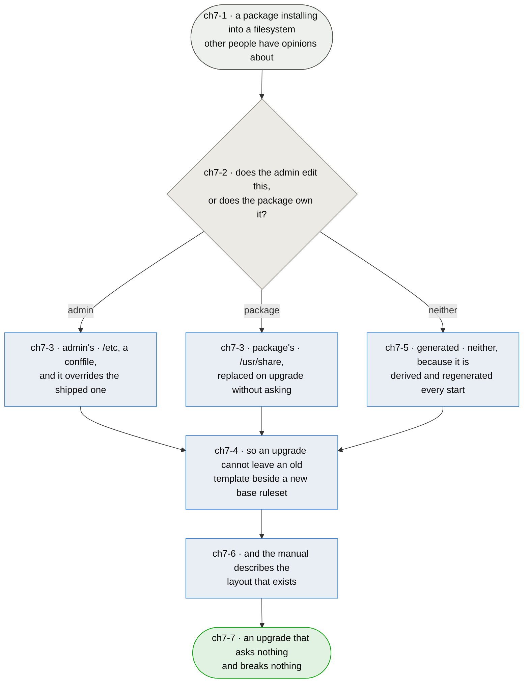

# Chapter 7 — the package installs where Debian expects, and an upgrade surprises nobody

> **As somebody who installed this from a repository I want an upgrade to bring me the new rules
> without asking me questions about files I never edited — and I want to be able to override one
> without my override being what breaks the next upgrade.**

**Measured on a host, not read off the packaging.** `dpkg-query -W -f='${Conffiles}'` reports **73
conffiles**: every rules template and every spoof list, because they install under `/etc/afirewall/`
and debhelper marks everything there as configuration. That is a lot of surface for files the
package owns and the admin has no ordinary reason to touch.

**And it is a skew hazard rather than a tidiness one.** The package's own tests gate three-way
consistency — every config key has a template, every template has a key, every include resolves in
its own family — because any two of those agreeing while the third drifts is how the bugs got in. On
an upgrade, dpkg keeps an edited conffile and installs the new version alongside as `.dpkg-dist`. So
a host that edited one template gets **an old template beside a new `base.rules`**, which is exactly
the skew those tests exist to prevent, on the one machine where no test is running.

**The design that avoids it is already written down.** The manpage says *"Distribution templates are
in /usr/share/afirewall/templates"* and *"Distribution lists are in /usr/share/afirewall/lists"*.
Neither is installed — `debian/afirewall.install` puts both only under `/etc`. The documentation
describes the right answer and the packaging never implemented it, so the manpage is currently
fiction and the fix is to make it true.

**A third thing is in the wrong place entirely.** `process_scripts` writes the generated `ipv4.nft`
and `ipv6.nft` into the base directory, so machine-generated output lands in `/etc`, unowned by
dpkg, churning under anything that watches configuration for changes.

*Shapes and colours: [legend](legend.md).*

## Story → test trace

| id | node | claim |
|---|---|---|
| `ch7-1` | a package installing into a filesystem other people have opinions about | **What is already right is worth stating, because the fix must not disturb it.** `/usr/sbin/afirewall` is an administrative binary in the right place; the manpage is in `man8`; the copyright and changelog are where `dpkg -L` expects; and `/usr/share/netfilter-persistent/plugins.d/afirewall` is the one location that makes the package persist without a unit of its own (`ch1`). `/etc/afirewall/afirewall.conf` is genuine configuration and is correctly a conffile. The complaint is narrow and is about the other 72 |
| `ch7-2` | does the admin edit this, or does the package own it? | **The question dpkg is really asking on every upgrade**, and the package currently answers it wrongly for 72 files. A conffile is a promise that the admin's version wins — which is right for `afirewall.conf`, where enabling a service *is* the configuration, and wrong for a rules template, which is the package's own expression of how a service should be filtered and which the package revises as it learns things. The test is not "could somebody edit it" but "is their edit meant to outlive the package's" |
| `ch7-3` | admin's in `/etc`, package's in `/usr/share`, and `/etc` wins | **An override story rather than a prohibition.** Templates and lists ship to `/usr/share/afirewall/`, are replaced on upgrade without a question, and a file of the same name under `/etc/afirewall/` takes precedence. Somebody who needs a different `ssh.rules` still gets one; what they no longer get is their copy quietly deciding what happens on every future upgrade. **The code is already shaped for it** — the Jinja loader takes a list of directories — so this is one entry and an install line, not a redesign |
| `ch7-4` | so an upgrade cannot leave an old template beside a new base ruleset | **The reason this matters, and it is the package's own invariant.** `test/test_afirewall.py` gates three-way skew: every conf key has a template, every template has a key, every include resolves in its own family. Those run in the repository. An upgrade that keeps one edited conffile creates precisely the skew they forbid, **on a host where nothing is checking** — and the failure it produces is a table nft refuses, which costs the host a whole address family rather than one service |
| `ch7-5` | generated is neither | **`ipv4.nft` is not configuration and does not belong in `/etc`.** It is derived from the config, regenerated on every `start`, and owned by nobody — dpkg does not know it exists, and anything watching `/etc` for change sees churn that means nothing. It goes to `/run/afirewall/` rather than `/var/lib/`: it is rebuilt from scratch at every boot, and a location that empties on boot makes it impossible to load a stale ruleset that no longer matches the configuration — which is a property worth more than being able to read the last one after a failure |
| `ch7-6` | and the manual describes the layout that exists | **The manpage already documents the right design and the packaging never built it**, which is worse than documenting nothing: a reader who follows it looks for `/usr/share/afirewall/templates` and finds an empty directory. Documentation that describes an intention is indistinguishable from documentation that describes a fact, and this chapter is finished when the two agree |
| `ch7-7` | an upgrade that asks nothing and breaks nothing | **The measure is a host that has never been touched taking a new release silently**, and a host that overrode one template taking it too — with its override still in force and nothing else held back. Not that the package ships fewer files |

## Input → process → output

**Input** — a package installing into a filesystem other people have opinions about (`ch7-1`).

**Each file is sorted by who owns it** (`ch7-2`): what the admin edits goes to `/etc` as a conffile,
what the package owns goes to `/usr/share` and is replaced without asking, with `/etc` taking
precedence when both exist (`ch7-3`). Generated output goes to neither, because it is derived and
rebuilt every start (`ch7-5`). That is what makes an upgrade unable to leave an old template beside a
new base ruleset (`ch7-4`), and the manual is corrected to describe what is actually installed
(`ch7-6`).

**Output** — an upgrade that asks nothing and breaks nothing (`ch7-7`).

## Open unknowns

- **ch7-U1 — the migration for hosts that already have the 73.** A host installed today has every
  template as a conffile. Moving them to `/usr/share` means dpkg must be told to remove conffiles it
  no longer ships, which is `dpkg-maintscript-helper rm_conffile` in a maintainer script, one line
  per file. What is undecided is whether an *edited* one should be preserved into `/etc` as a real
  override or removed with the rest — preserving it is kinder and re-creates the skew hazard for
  that host, removing it is safer and silently discards somebody's change. Anchored to `ch7-3`.

- **ch7-U2 — nothing has observed an upgrade doing any of this.** The claims are read from
  `debian/afirewall.install`, from `dpkg-query` on one host, and from what debhelper does with
  `/etc`. Installing an old release, editing a template, upgrading, and looking at what survived is
  the reading that would settle `ch7-4` and `ch7-7`, and it needs two releases and a disposable
  host rather than an inspection. Anchored to `ch7-7`.

- **ch7-U3 — whether `lists/` sorts the same way as `templates/`.** The spoof lists are IANA
  registry data, which the package owns as surely as it owns a template — but they are also the
  most plausible thing for an operator to extend, and a site with its own bogon policy has a real
  reason to. The same `/usr/share` default with an `/etc` override answers it, and what is undecided
  is whether an override should *replace* the shipped list or be read in addition to it. Anchored to
  `ch7-3`.

## Glossary

| Term | Meaning |
|---|---|
| Conffile | A file dpkg treats as the admin's, preserving their version across upgrades and asking before replacing it (`ch7-2`) |
| Override | A file under `/etc/afirewall/` that takes precedence over the same name under `/usr/share/afirewall/` (`ch7-3`) |
| Skew | Two of config, template and include agreeing while the third does not — what the package's own tests gate and what a kept conffile re-creates (`ch7-4`) |
