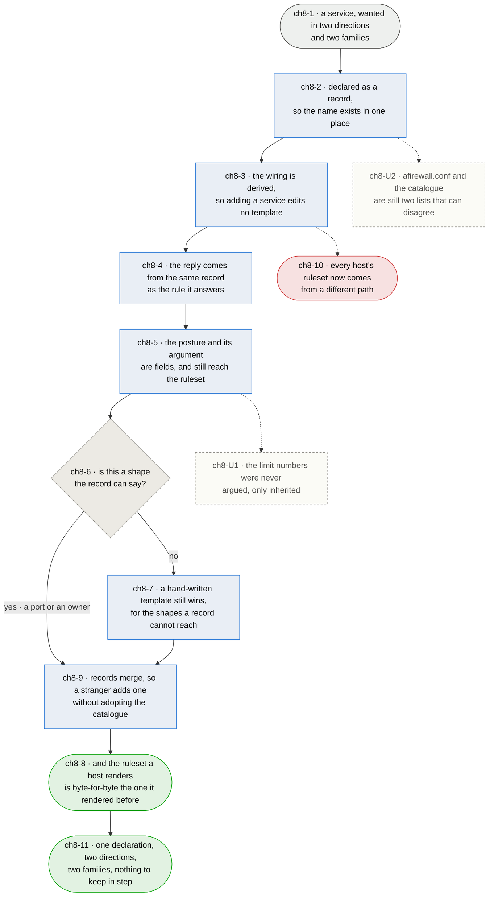

# Chapter 8 — a service is declared once, and everything else is derived

> **As somebody maintaining this package I want a service to be one declaration rather than four
> hand-written places, so that its two directions cannot drift apart — because the linkage that
> holds them together is the thing that has actually broken, twice, silently.**

**This chapter exists because the evidence came in.** `base.rules` names every service a line at a
time, and the stated reason was to keep rendering clean and to keep a service's two directions tied
to one flag. The second is the right property to want. It is also the one that failed: the tie is
the same flag name typed by hand in four places per service — an include, a jump, and a reply in the
*other* direction's chain, in each family — and nothing validates that the four agree.

**Measured on 2026-08-17, two of them do not.** `` guards the reply path for
`inbound.tcp2194`, and `` guards a port no service has. Rendering with
`inbound.tcp2194` enabled produces its chain, both its limits and its jump — and **no reply rule at
all**, in either family. The output chain's policy is drop, so the answer to a connection this
service accepted is dropped on the way out. It is a dead service that reads as a live one, and the
transposition that caused it is two characters in a file whose purpose is to prevent exactly that.

**What the templates were carrying turns out to be a table.** Seventeen of seventeen inbound
templates are the same shape: two sets, two limit rules, three rule lines. Fourteen of sixteen
outbound templates are one `accept` line. What varies across all thirty-three is a rate, a count, a
posture, a selector — a port or a `meta skuid` — and the prose arguing for the posture. **One axis
of structure, and one of argument.** The rest is 66 files of identical shape, policed by four tests
that exist only because files of identical shape drift from each other.

**The argument is what earns its place, and it is not what is being removed.** `ch1-6` is the best
thing in this package and it is prose about a decision, not a file. It becomes a field, emitted into
the rendered ruleset where it already appears. What goes is the requirement to keep four hand-typed
copies of a name in step.

**This changes what every host renders, so it is not a refactor.** The claim that makes it safe is
`ch8-8`, and it is a diff rather than an assurance.

*Shapes and colours: [legend](legend.md).*

## Story → test trace

| id | node | claim |
|---|---|---|
| `ch8-1` | a service wanted in two directions and two families | **A service is four artifacts today and one idea**, and the gap between those two numbers is where every defect in this area has lived. `smtp` inbound is a template in ipv4, a template in ipv6, an include, a jump and a reply line in each family's `base.rules` — and one flag that is supposed to hold them together. Nothing about the arrangement makes the four agree; the operator's care does |
| `ch8-2` | declared as a record | **The name exists once, and that is the whole mechanism.** A record carries the direction, the protocol/port pairs or the owner, the posture, the argument and the two limit numbers — everything that was varying across thirty-three templates. The format is TOML because the argument is prose that must be able to carry comments beside it, which is the one thing JSON cannot do and the reason it is not JSON. `tomllib` is in the standard library on the target, so this adds no dependency (`ch1-7` is about nft, and this does not touch it) |
| `ch8-3` | the wiring is derived | **`base.rules` stops naming services and starts looping over them**, so adding a service edits no template at all. This is what dissolves `ch2-U4`: there is no longer an edit to `base.rules` to place, so there is no choice between clobbering the shipped copy and adopting it forever. A stranger's added service and an upstream correction to `base.rules` stop being the same decision |
| `ch8-4` | the reply comes from the same record | **The property `base.rules` was naming services to get, obtained by construction instead of by care.** An inbound service's reply line in the outbound chain is rendered from the record that rendered its inbound rule, so the two cannot carry different names or different ports. `inbound.tcp2914` is not a mistake that can be made here — not because somebody is more careful, but because there is no second place to type it |
| `ch8-5` | the posture and its argument are fields | **`ch1-6` survives intact and lands in the same place it lands today** — a `# LIMIT POSTURE:` comment inside the chain, in the rendered ruleset. What changes is where the prose is stored, not whether it exists or where a reader finds it. A record with a limit and no argument is refused, exactly as `ch2-5` refuses one at authoring time; the difference is that the refusal now applies to the shipped catalogue too |
| `ch8-6` | is this a shape the record can say? | **A record covers a service selected by port, and the honest answer to everything else is no.** `ch2-U2` said a generator understanding only ports should not pretend otherwise, and this is that limit stated rather than discovered. The two `meta skuid` templates are what the limit looks like: outbound tor and btc key on the local socket's owner, carry one set rather than two, put the rate inline rather than in a set, and order their rules the other way round. That is four differences, not one, and a record format stretched to say them would be a template with extra steps — so they take the next branch, and the branch has real occupants rather than being a courtesy |
| `ch8-7` | a hand-written template still wins | **The escape hatch is the file mechanism that exists today, demoted from the default to the exception.** A template present for a service is used instead of rendering its record, so an operator with an unusual service writes arbitrary nft exactly as they can now. What they no longer do is write a hand-crafted file for `postgres`, whose rule is a port and two numbers |
| `ch8-8` | the ruleset is the one it rendered before | **The claim that makes this safe, and it is a diff rather than an argument.** A change of this size justified by reasoning about equivalence would be the same mistake as a counter nobody read: plausible, checkable, and unchecked. **Measured 2026-08-17**, every flag enabled, both families, old path against new: **zero rules lost, four gained in each family.** 18 posture notes, 34 set declarations and 41 chains before and after; every argument's text still present. The four gained are the defects, not regressions — the replies `inbound.tcp2194` and `inbound.tcp8000` never had, and the jump and the reply `outbound.udp1514` never had. **Three shipped services were dead or half-dead and every test the package had passed**, which is the measurement this chapter was worth taking. Two differences are deliberate and are not rules: the order within a group is now alphabetical, which cannot matter because every rule in a group selects a distinct port or owner and a packet matches at most one; and the set comments are one shape off the service's name, where the hand-written ones were four shapes and a typo. **The diff was a one-time instrument** and cannot be re-taken now the templates it compared against are gone — what carries forward is `ch8-4`'s property, which is what a drill can hold |
| `ch8-9` | records merge | **A stranger adds a service by adding a record, not by adopting the catalogue.** The base directory's records are merged over the shipped ones by direction and name, so the shipped list keeps arriving with upgrades. Replacing rather than merging would rebuild `ch2-U4` one level up — the same trap in a new file, which is the failure mode this package keeps finding |
| `ch8-10` | every host's ruleset now comes from a different path | **A bad ending accepted deliberately.** The rules a host loads were produced by 66 files a person could read one at a time, and are now produced by one renderer and a table. A reader who wants to know what `postgres` does opens a record and a template rather than a file. That is a real loss of local readability, taken because every defect this package has actually had was cross-file — three-way skew, a v4 selector in a v6 template, two dead guards — and cross-file is what a table removes |
| `ch8-11` | one declaration, nothing to keep in step | **Success is the four tests that stop being necessary**, not the lines removed. Every-key-has-a-template, every-template-has-a-key, every-template-is-reachable and every-service-jumps-into-its-own-chain are all questions about whether files agree, and a single declaration is what makes them unaskable |

## Input → process → output

**Input** — a `service` somebody wants reachable, in two directions and two families (`ch8-1`).

**It is declared once** as a `record` (`ch8-2`), and the `wiring` is derived from that record rather
than written beside it (`ch8-3`) — including the reply path, which is what makes the two directions
incapable of disagreeing (`ch8-4`). The `posture` and the argument for it are fields on the record
and still arrive in the rendered ruleset where a reader already looks for them (`ch8-5`).

**A shape the record cannot say takes the other branch** (`ch8-6`): a hand-written `template` for
that service wins over its record, which is the mechanism that exists today kept as the exception
(`ch8-7`). Records `merge` over the shipped catalogue rather than replacing it (`ch8-9`).

**Output** — a `ruleset` byte-identical to the one this host rendered before (`ch8-8`), from one
declaration with nothing left to keep in step (`ch8-11`), at the cost of a rendering path no longer
readable one file at a time (`ch8-10`).

## Data definitions

| Element | Type | Card. | Domain | Enforced | Provenance |
| --- | --- | --- | --- | --- | --- |
| `record` | declaration | 1 per service per direction | name, direction, and either protocol/port pairs or an owner; posture, argument, rate and count where there is a limit (`ch8-2`) | yes — a limit with no argument is refused | authored, in `services.toml` |
| `wiring` | derived | 3 per record per family | the include, the jump in its own direction, and the reply in the other one. **Written nowhere**: `base.rules` loops (`ch8-3`, `ch8-4`) | yes — by there being no second place to write it | derived |
| `posture` | enforce \| instrument | 1 per limit-bearing record | chapter 1's term, with the argument beside it as prose (`ch8-5`, `ch1-6`) | yes | authored |
| `template` | file | 0..n | a hand-written service template, which wins over that service's record. Two today — the `meta skuid` pair — and the number should fall rather than rise (`ch8-6`, `ch8-7`) | no | authored |
| `catalogue` | file | 2 — shipped and local | the shipped records, merged under the base directory's by direction and name (`ch8-9`) | yes | shipped, and authored |
| `ruleset` | rendered nft | 2 per host | what the kernel loads. **Byte-identical to the previous path's output** except the two dead guards (`ch8-8`) | yes — by diff | derived |

### What each step takes and leaves

| Step | Consumes | Produces |
| --- | --- | --- |
| declare (`ch8-2`) | a `service` | one `record`, and one place its name exists |
| derive (`ch8-3`, `ch8-4`) | `record` | `wiring` in both directions that cannot disagree |
| argue (`ch8-5`) | `posture` | a rule carrying the reason it is that way |
| escape (`ch8-6`, `ch8-7`) | `template` | a shape no record can say, still expressible |
| merge (`ch8-9`) | `catalogue` | a stranger's service, and upgrades still arriving |
| prove (`ch8-8`) | old and new `ruleset` | a diff, rather than a reason to believe |

## Open unknowns

- **ch8-U1 — the limit numbers were never argued, only inherited.** Every instrumenting record
  carries `5/minute` and `20` except http and https at `50/minute` and `200`, and the enforcing ones
  carry numbers of their own. `ch1-6` made the *posture* argued and left the numbers alone, so the
  catalogue now writes down, in one readable table, a set of values nobody chose against any
  service's measured traffic. Making them visible is not the same as making them right, and seeing
  them side by side is the first time the question has been askable. It is `ch1-U2` again, arriving
  where it can finally be read. Anchored to `ch8-5`.

- **ch8-U2 — `afirewall.conf` and the catalogue are two lists that can still disagree.** A flag with
  no record is the same fault as `inbound.tor`, one file along; `afirewall enable` refuses it at the
  point of writing (`ch3-2`), and nothing refuses it in the shipped `afirewall.conf` itself. The
  three-way skew this chapter removes becomes a two-way skew it does not. The candidate answer is
  for the shipped `afirewall.conf` to be derived from the catalogue as well — every record's flag,
  disabled — which would make the second list a rendering rather than a copy. Whether that breaks
  `ch1-2`'s promise that the file is a plain list a configurator appends to has not been worked out.
  Anchored to `ch8-2`.

- **ch8-U3 — nothing decides what happens to a record whose template also exists.** `ch8-7` says the
  template wins, which is right for the operator overriding a shipped service and wrong as a silent
  outcome: a stranger who copies a template to read it, and leaves it there, has quietly frozen that
  service against every upgrade to its record. The same shape as `ch2-U4` and not yet the same
  answer. Saying so at render time is the cheap half; deciding whether it should warn, refuse, or
  require the record to opt out is not done. Anchored to `ch8-7`.

## Glossary

| Term | Meaning |
|---|---|
| Record | One service's declaration: name, direction, ports or owner, posture, argument, limits. The single place its name exists (`ch8-2`) |
| Derived | Produced from the record at render time rather than written beside it. The wiring is derived; that is the whole of `ch8-3` |
| Catalogue | The set of records — the package's shipped one, with the base directory's merged over it (`ch8-9`) |
| Escape hatch | A hand-written template for a service whose shape no record can say. The default mechanism today, the exception afterwards (`ch8-7`) |
